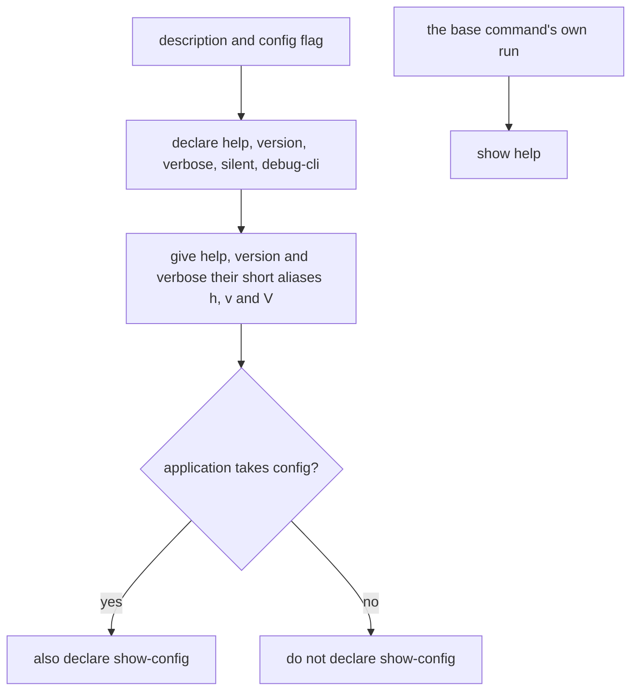
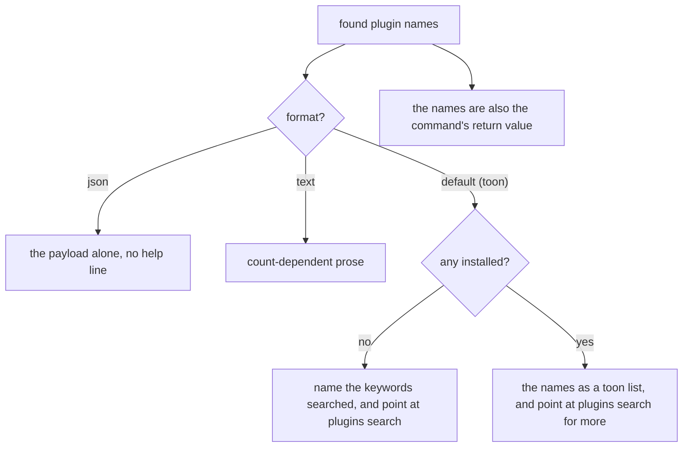
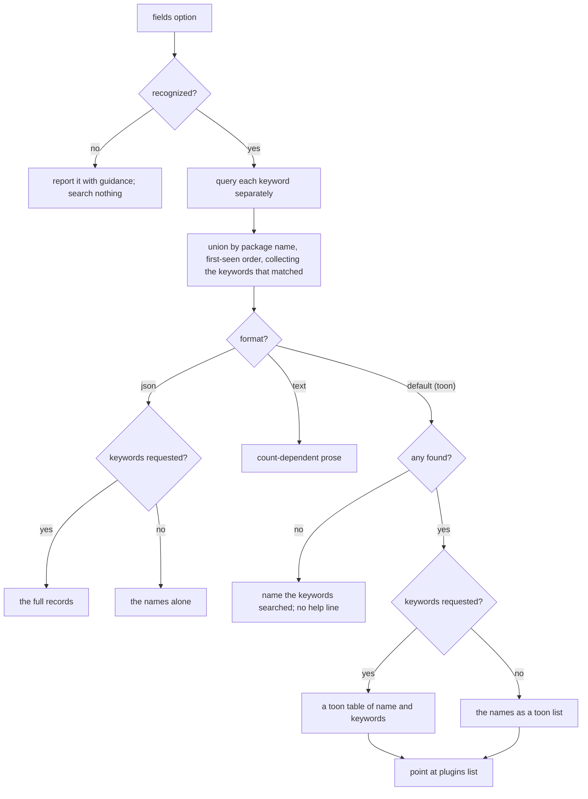
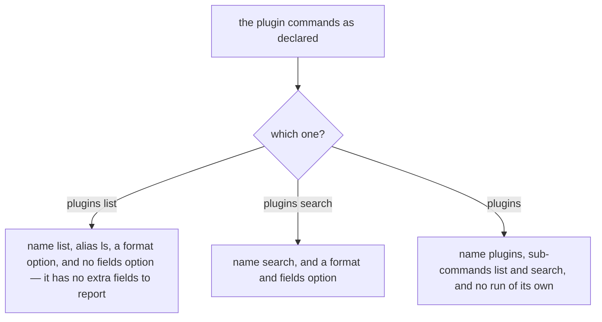

# Built-in commands

Governs `ts/builtin/` — the commands `clibuilder` ships to every application it
builds, so a CLI can report on its own plugins without its author writing those
commands. `base_command.ts` carries the global options every invocation gets;
`plugin_commands/` is the plugin discovery that only the framework can
implement.

## What

Every application gets two things it did not write. The **base command** is the
invisible root carrying the options every CLI is expected to have — help,
version, the logging levels — so that no author has to declare `--help` and no
user has to wonder whether this particular CLI supports it. The **`plugins`
command** lets a user see which plugins are installed and find more, which only
the framework can implement because only the framework knows how plugins are
discovered.

The base command's option set is not fixed: `--show-config` appears only on an
application that actually takes configuration, so a CLI never advertises an
option that could not do anything.

The plugin commands' output is written for **two readers at once**. A person
wants prose. A script or an agent wants a shape it can parse without branching
on how many results there turned out to be — so both structured formats report a
list of one as a list. Where they part is the empty result: the **default toon
format** names the keywords that were searched instead of printing an empty
array, because an agent that sees `packages[0]:` tends to retry with different
flags to check it did not filter the answer away, while **json** keeps the same
shape it always has, an empty list under the usual key, because a `| jq`
consumer wants one shape to parse rather than prose about why there was nothing.

**Non-goals.** How a command is matched and run belongs to `execution/`. How
plugin packages are resolved and activated belongs to `plugins/`. The rendering
primitives — the TOON encoders, the prose reporter, the `--format` option
itself — belong to `presentation/`; this node decides *what* to report and in
which shape, not how the shape is written.

**Key terms.** The **base command** is the nameless root command. A **format**
is the reader's chosen output shape. A **help line** is the trailing suggestion
naming the next command to run. **Installed** means present in the local
package tree and carrying the application's keywords — what `plugins list`
reports. It is independent of `plugins/`'s **activation**: a package the
configuration never named is still installed, and `plugins list` finds it by
keyword rather than by anything the configuration says.

## Use Cases

**Actors.**

| Actor | Reaches this capability | Goal |
| --- | --- | --- |
| CLI end user | runs `plugins list` or `plugins search` | see what is installed, and find more to install |
| Agent or script reading the output | passes `--format json` or reads the default TOON | get a parseable answer, and a next step when the answer is empty |
| CLI author | gets these commands for free | not implement plugin discovery, and not declare `--help` |
| `execution` | installs the base command and the plugins command | have the global options and the plugin commands present on every application |
| CLI author embedding `plugins list` | reads its return value | reuse the found names without parsing the printed report |

**Unserved goals — recovered from the issue tracker, not from the source.** A
backfill drawn from code yields only the goals already served, so this was
recovered separately. **It has no entry point today**, and so appears in neither
the Control Flow nor the suite:

| Actor | Goal | Provenance |
| --- | --- | --- |
| CLI end user | find installed plugins in a project with no `node_modules` — a Yarn PnP install | [#575](https://github.com/clibuilder/clibuilder/issues/575), split from [#327](https://github.com/clibuilder/clibuilder/issues/327). Loading and running plugins under PnP works; only keyword *discovery* fails, because it scans `node_modules` |

### UC1 — `getBaseCommand`: the global options every application carries

**Actor / goal.** `execution` wants the root command carrying the options a
user expects of any CLI.

| | |
| --- | --- |
| Trigger | `getBaseCommand(description, { config })` |
| Inputs | the application's description, and whether it takes configuration |
| Outcome | a nameless command declaring the global options |

**Extensions.** `--show-config` is declared only when the application takes
configuration. The base command declares a `run` of its own that shows help —
it is not falling through `execution/`'s no-`run` path, it is choosing help as
its work.

### UC2 — `plugins list`: report the installed plugins

**Actor / goal.** A user wants to know which plugins this CLI has available, and
what to do if there are none.

| | |
| --- | --- |
| Trigger | `plugins list`, or its alias `ls` |
| Inputs | the application's keywords; an optional format |
| Outcome | the installed plugin names, reported in the chosen format and returned to the caller |

**Extensions.**

| Cause | Outcome |
| --- | --- |
| nothing is installed | the report says so, naming the keywords searched, and points at `plugins search` — nothing installed says nothing about what exists on npm |
| the reader asked for JSON | the payload alone, with no trailing help line, so a `jq` consumer gets only what it asked for |
| the reader asked for text | count-dependent prose, which is what makes it read as English |
| the caller embeds the command | the found names are its return value as well as its output |

### UC3 — `plugins search`: find plugins on npm

**Actor / goal.** A user wants to discover plugins for this CLI that they have
not installed.

| | |
| --- | --- |
| Trigger | `plugins search` |
| Inputs | the application's keywords; an optional format; optional extra fields |
| Outcome | the packages found, reported in the chosen format |

**Extensions.**

| Cause | Outcome |
| --- | --- |
| the application declares several keywords | each is searched separately and the results unioned, because the underlying search matches packages carrying **all** the keywords it is given while the CLI wants any of them |
| a package matches several keywords | it appears once, carrying each keyword that matched it, in first-seen order |
| `--fields` names something unrecognized | it is reported with guidance and nothing is searched — silently narrowing the result is worse than an error |
| `--fields name` | accepted as a no-op, since the name is the row's identity and is always present |
| nothing is found | the keywords are named rather than an empty array printed |

### UC4 — `plugins`: group the plugin commands

**Actor / goal.** A user wants the plugin commands under one obvious name.

| | |
| --- | --- |
| Trigger | `plugins` |
| Inputs | none |
| Outcome | help listing `list` and `search` |

**Extensions.** The group declares no `run`. What that produces — help, rather
than nothing — is `execution/`'s decision for any command without a `run`, and
is specified there; what this node owns is the declaration.

**Surface trace.**

| Element | Required by | May not combine with |
| --- | --- | --- |
| `getBaseCommand` | UC1 | — |
| `--help` / `--version` / `--verbose` / `--silent` / `--debug-cli` and their aliases | UC1 | — |
| `--show-config` | UC1 | an application declaring no config — it is not declared there |
| `listPluginsCommand` and its `ls` alias | UC2 | — |
| `searchPluginsCommand` | UC3 | — |
| `--format` on both | UC2, UC3 | — |
| `--fields` | UC3 | — (declared on `plugins search` only; `plugins list` has no extra fields to report) |
| `pluginsCommand` | UC4 | — |

## Control Flow

### Sub-graph A — the base command, entered by UC1

The base command declares a `run` of its own, so showing help is this node's
decision rather than `execution/`'s no-`run` fallback.

### Sub-graph B — report the installed plugins (`plugins list`), entered by UC2

### Sub-graph C — search npm (`plugins search`), entered by UC3

### Sub-graph D — what the three plugin commands declare, entered by UC2, UC3 and UC4

The reporting logic above is reached only once a command has been matched; what
each command *declares* is the decision that gets it matched at all.

Declaring no `run` is what makes the bare group show help — but the showing is
`execution/`'s decision, so what this node specifies is the declaration.

## Scenario map

### UC1 — `getBaseCommand`

| Edge | Path (Given) | Scenario |
| --- | --- | --- |
| declare help, version, verbose, silent, debug-cli | any | `every application declares help, version, and the logging options` |
| give help, version and verbose their short aliases | any | `the global options carry their conventional short aliases` |
| also declare show-config | the application takes config | `an application taking config also declares show-config` |
| do not declare show-config | the application takes no config | `an application taking no config does not advertise show-config` |
| the base command's own run | the application is invoked with no command | `running the base command itself shows help` |

### UC2 — `plugins list`

| Edge | Path (Given) | Scenario |
| --- | --- | --- |
| the names as a toon list | plugins installed, default format | `installed plugins are listed and point at search for more` |
| name the keywords searched | nothing installed, default format | `no installed plugins names the keywords searched and points at search` |
| the payload alone, no help line | JSON requested | `JSON output carries the payload and no help line` |
| the payload alone, no help line | JSON requested, nothing installed | `JSON output reports an empty result in the same shape as a full one` |
| count-dependent prose | text requested, reporting installed plugins | `text output reads as English about how many were found` |
| the names are also the command's return value | any | `the found names are the command's return value as well as its output` |
| name list, alias ls | any | `plugins list can be invoked as ls` |
| no fields option | any | `plugins list declares no fields option` |
| name search, and a format and fields option | any | `plugins search declares both a format and a fields option` |

### UC3 — `plugins search`

| Edge | Path (Given) | Scenario |
| --- | --- | --- |
| query each keyword separately | several declared keywords | `each keyword is searched separately so a package matching any of them is found` |
| union by package name, first-seen order, collecting the keywords that matched | a package matched by several keywords | `a package matched by several keywords is listed once carrying each` |
| report it with guidance | `--fields` names something unrecognized | `an unrecognized fields value is reported with guidance and nothing is searched` |
| recognized | `--fields name` | `asking for the name field is accepted as a no-op` |
| the names as a toon list | packages found, default format, no extra fields | `found packages are listed and point at plugins list` |
| a toon table of name and keywords | packages found, keywords requested | `asking for keywords reports a table of name and keywords` |
| name the keywords searched; no help line | nothing found, default format | `no packages found names the keywords searched rather than printing an empty list` |
| the names alone | JSON requested, no extra fields | `JSON output without extra fields carries the names alone` |
| the names alone | JSON requested, nothing found | `JSON output from search reports nothing found in the same shape as a full result` |
| the full records | JSON requested, keywords requested | `JSON output with keywords carries the full records` |
| count-dependent prose | text requested, reporting search results | `text output describes the packages found in prose` |

### UC4 — `plugins`

| Edge | Path (Given) | Scenario |
| --- | --- | --- |
| no run of its own | any | `the plugins group declares no run of its own` |
| sub-commands list and search | any | `the plugins group carries list and search` |
