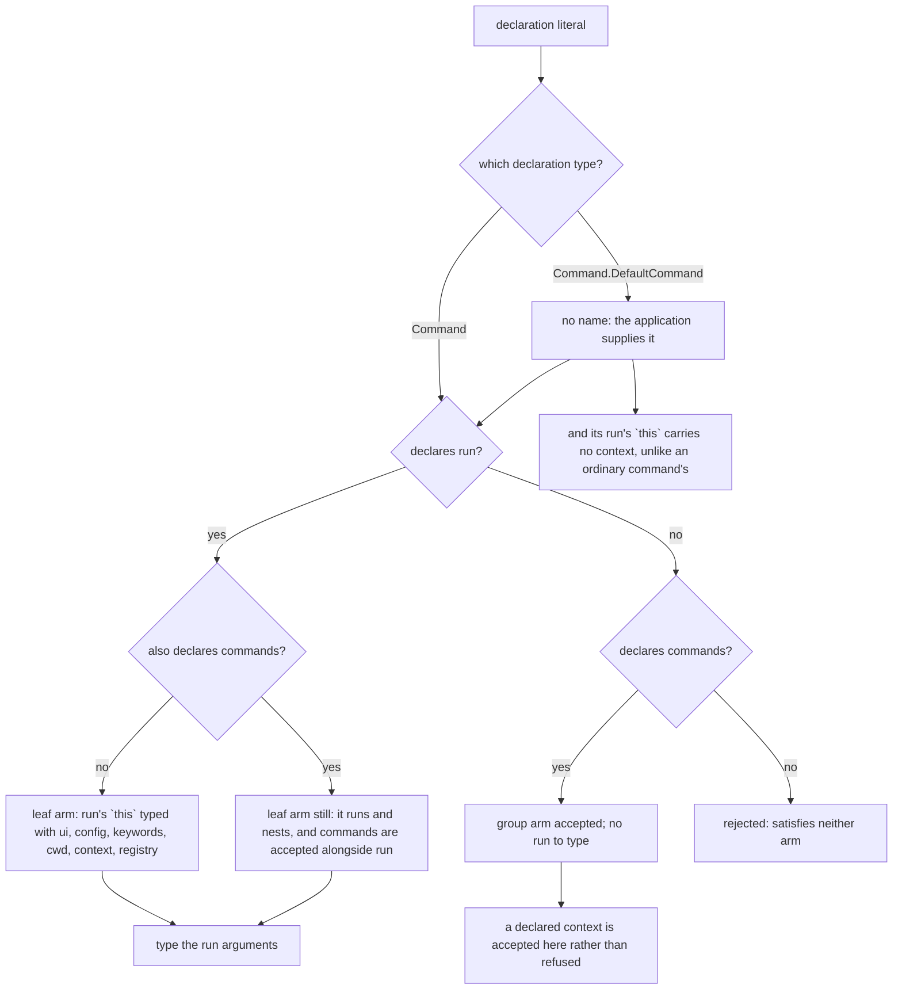
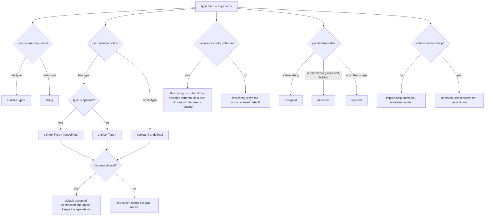
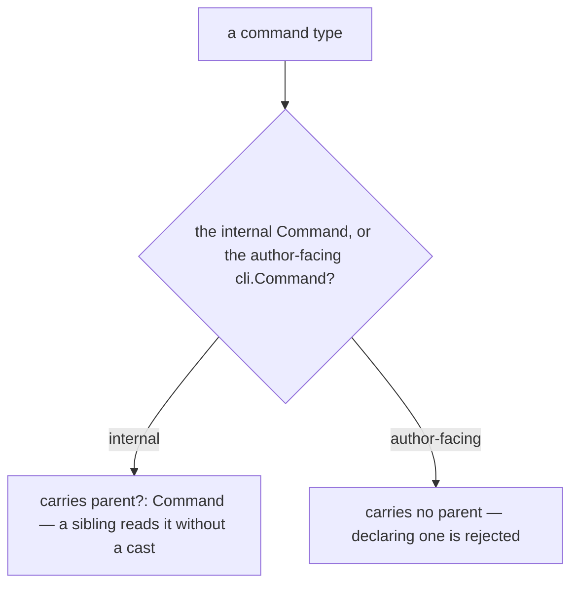

# Command definition

Governs `ts/command/` and the `cli` namespace in `ts/cli.ts` — the shape a
command author declares: name, alias, description, arguments, options, nested
sub-commands, and the types those declarations produce.

## What

A `clibuilder` application is assembled from **declarations**. A command author
writes down what a command is called, what it accepts, and what it does; the
framework reads that one declaration for everything else it needs — matching an
argv vector to a command, coercing and validating the inputs, and rendering
help. Nothing about a command is stated twice.

This capability owns the **declaration itself**: its permitted shape, and the
`run`-argument types it produces. Because the framework reads the declaration
rather than a separate schema, the declaration is also where the author gets
their return on stating a type — declaring an argument as a number is what makes
`args.arg1` a `number` inside `run`.

Almost every decision here resolves in the **type system**. `command()` is an
identity function at runtime: its whole value is that it constrains the literal
it is handed and infers the `run` signature from it. The acceptance point for
this node is therefore the compiler, observed through `type-plus`'s `testType`
assertions.

**Non-goals.** Matching argv against the declared tree, coercing raw strings, and
reporting a validation failure belong to `input-parsing/`. Assembling an
application from declarations and running the matched command belong to
`execution/`. Rendering the declaration as help belongs to `presentation/`.
Accepting a declaration contributed by a third party belongs to `plugins/`. This
node stops at what may be declared and what that declaration types.

**Key terms.** A **leaf** command declares `run` and does the work. A **group**
command declares `commands` and only nests. A **default command** is the one the
application runs when argv names no sub-command; it omits `name`, which the
application supplies. An **implicit option** is one the framework adds to every
command without the author declaring it — there is exactly one, `help`.

## Use Cases

**Actors.**

| Actor | Reaches this capability | Goal |
| --- | --- | --- |
| CLI author | writes a declaration, directly or through `command()` | state a command once and have its `run` arguments typed from that statement |
| Plugin author | hands a declaration to `addCommand` | contribute a command to a host application without compiling against it |
| Sibling capabilities (`input-parsing`, `presentation`, `execution`) | read the declaration | have one source to route, validate, and render from |
| CLI end user *(stakeholder — never invokes this node)* | — | the help text and the input errors they see are exactly what the author declared |

The end user is the stakeholder where a missed use case hides: they are affected
by every declaration decision and can invoke none of them, so a shape the author
can express but the framework cannot render is this node's defect, not
`presentation/`'s.

**Unserved goal — recovered from the issue tracker.** It has no entry point
today, so it appears in neither the Control Flow nor the suite:

| Actor | Goal | Provenance |
| --- | --- | --- |
| Command author | have an option that declares a default type as present, rather than as possibly `undefined` | [#274](https://github.com/clibuilder/clibuilder/issues/274) — closed without an implementation. `RunArgs` types an option as `z.infer<OT>`, so an optional type stays `T \| undefined` even when a `default` guarantees a value. Verified with a type probe |

### UC1 — `command()`: declare a command and infer its run arguments

**Actor / goal.** A CLI author wants a command's `run` arguments typed from the
same declaration the framework routes and validates by, without repeating the
types.

| | |
| --- | --- |
| Trigger | the author calls `command(cmd)` |
| Inputs | a declaration literal: a required `name`, optional `description` / `alias` / `config` / `arguments` / `options`, and either `run`, `commands`, or both |
| Outcome | the literal is returned unchanged, narrowed to its own shape, with `run`'s `args` parameter typed from the declared `arguments` and `options` |

**Extensions.**

| Cause | Outcome |
| --- | --- |
| the declaration has neither `run` nor `commands` | rejected — it satisfies neither arm of the `Command` union |
| an argument omits `type` | accepted; that argument types as `string` — the raw argv form, unconverted |
| an option omits `type` | accepted; that option types as `boolean \| undefined` — a flag that may be absent |
| an option's `type` is optional | accepted; the inferred type carries `\| undefined` |
| an option's `default` disagrees with its `type` | **accepted, unchecked** — see the gap below; the option still types as its declared type, so `run` receives a value the declaration says is impossible |
| the author declares an option named `help` | accepted; the declared type replaces the implicit one rather than colliding with it |
| a command declares a `config` schema | `run` reads `this.config` at that schema's type; a field the schema omits is refused |
| an option declares an alias | it is a bare string or a `{ alias, hidden }` pair; any other shape is rejected |

At runtime this use case has **no** extensions — `command()` returns its
argument and cannot fail. Every row above is a compile-time path.

**Known gap — `default` is not checked against `type`.** `Options` is declared as
`Record<Name, Options.Entry<Type>>` with `Type` defaulting to `z.ZodType<any>`
and never inferred per entry, so `Entry`'s `default?: z.infer<Type>` widens to
`any`. An option declaring `type: z.array(z.string())` and `default: 5` compiles,
and `args.abc` still types as `string[]`. The specified behavior below is the
current one; closing the hole needs per-entry inference of `Type` and is tracked
as a followup in this spec's ledger.

### UC2 — `Command.parent`: carry a command's place in the tree

**Actor / goal.** A sibling capability walking the command tree wants to reach a
matched command's ancestors — to build its full invocation path for help, or to
resolve a name relative to its parent.

| | |
| --- | --- |
| Trigger | the framework augments a declaration as it registers it into the tree |
| Inputs | a declared `cli.Command` |
| Outcome | the internal `Command` type — the declaration plus an optional `parent` link |

**Extensions.**

| Cause | Outcome |
| --- | --- |
| the command is at the root of the tree | `parent` is absent — the base case that ends a walk, not a failure |
| an author writes `parent` into a declaration | rejected — the author-facing type does not carry it |

Nothing else can happen here: the widening is structural, and *when* a `parent`
is actually set is `execution/`'s decision rather than this node's.

**Surface trace.** Every element the capability exposes, against the use case
requiring it:

| Element | Required by | May not combine with |
| --- | --- | --- |
| `name` | UC1 | — (required here; the nameless form is the separate `Command.DefaultCommand` type below) |
| `description`, `alias` | UC1 | — |
| `config` | UC1 — types `this.config` in `run` | — |
| `arguments`, `options` | UC1 — types `args` in `run` | — |
| `run` | UC1 | — (may coexist with `commands`) |
| `commands` | UC1 | — |
| `context` | UC1 — types `this.context` in `run` | — (a `commands`-only declaration accepts it too) |
| `parent` | UC2 | — (internal; never author-declared) |
| `Command.DefaultCommand` | UC1 | — (declares no `name`, and its `run` reaches no `context`) |
| `Options.Entry.alias` and `Options.Alias` | UC1 — an option's own aliases | — (either a bare string or a `{ alias, hidden }` pair) |

## Control Flow

`command()` performs no runtime work, so the graph below is the **type
resolution** the compiler runs over the declaration literal. It has two
independent sub-graphs — arm selection, and the typing of what `run` receives —
which do not interact: a group command simply never reaches the second. The
second covers three declared surfaces: the arguments and options that become
`args`, and the `config` schema that becomes `this.config`.

### Arm selection

### Run-argument typing

Entered only from the leaf arm. Each declared entry resolves independently, and
the results merge into one `args` object.

### The `parent` widening

Entered by UC2. `parent` is not part of the declaration an author writes — it is
added by the internal `Command` type, so the one decision is which of the two
types a reader is holding.

Whether a registered command's `parent` is actually set is `execution/`'s
decision, and walking the chain to build a usage line is `presentation/`'s.
This node owns only the type that makes both possible.

## Scenario map

### UC1 — `command()`

| Edge | Path (Given) | Scenario |
| --- | --- | --- |
| no name: the application supplies it | a default command's declaration | `a default command declaration needs no name` |
| its run's `this` carries no context | a default command declaring a run | `a default command's run cannot reach a context` |
| declares `run`, no `commands` | any | `a declaration with run is accepted as a leaf command` |
| it runs and nests | `run` and `commands` together | `a declaration with both run and commands is accepted and still types its run` |
| declares `commands`, no `run` | any | `a declaration with only commands is accepted as a group` |
| a declared context is accepted here rather than refused | a group declaration also carrying `context` | `a context on a group declaration is accepted rather than refused` |
| declares neither | any | `a declaration with neither run nor commands is rejected` |
| argument has `type` | any | `a typed argument types as its declared type` |
| argument omits `type` | any | `an untyped argument types as string` |
| option has `type` | non-optional type | `a typed option types as its declared type` |
| option has `type` | optional type | `an optionally-typed option types as its type or undefined` |
| option omits `type` | any | `an untyped option types as an optional boolean` |
| this.config is z.infer of the declared schema | a command declaring a config schema | `a declared config schema types what run reads from this.config` |
| this.config stays the unconstrained default | a command declaring no config schema | `a command with no config schema puts no shape on this.config` |
| a bare string | an alias declared as a bare string | `an option alias may be declared as a bare string` |
| a pair carrying alias and hidden | an alias declared as a hidden pair | `an option alias may be declared as a pair that marks it hidden` |
| any other shape | an alias pair missing its hidden flag | `an alias shape outside the union is rejected` |
| `default` accepted unchecked; the option keeps the type above | any — matching or contradicting | `an option default is accepted without being checked against its type` |
| implicit `help` added | options omit `help` | `help is present on a command that declares no options` |
| declared `help` replaces implicit | options declare `help` | `a declared help option replaces the implicit one` |

### UC2 — `Command.parent`

| Edge | Path (Given) | Scenario |
| --- | --- | --- |
| carries `parent?: Command` | the internal `Command` type | `the internal command type lets a reader reach a parent without a cast` |
| carries no `parent` | the author-facing `cli.Command` | `a declaration writing parent itself is rejected` |
