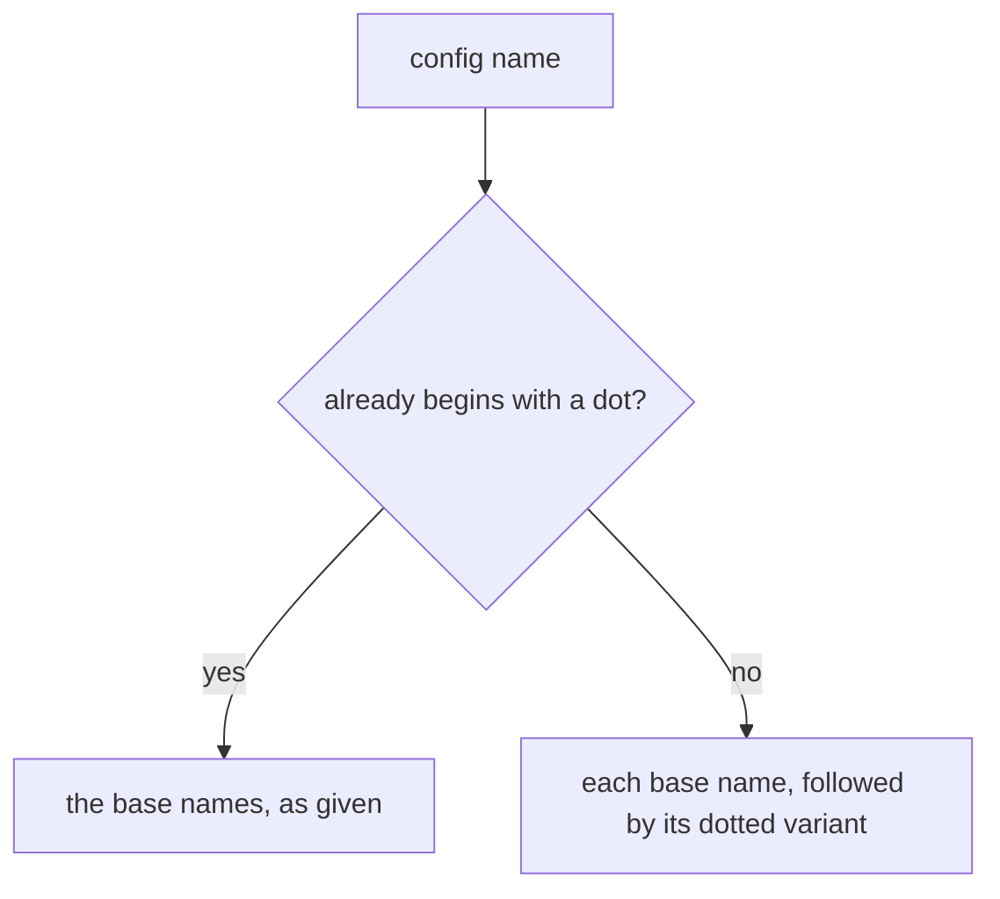
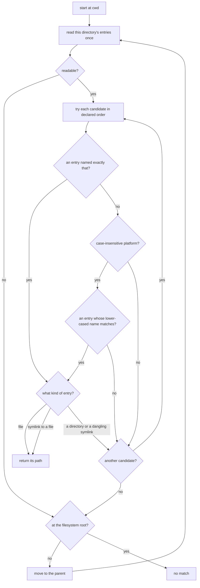
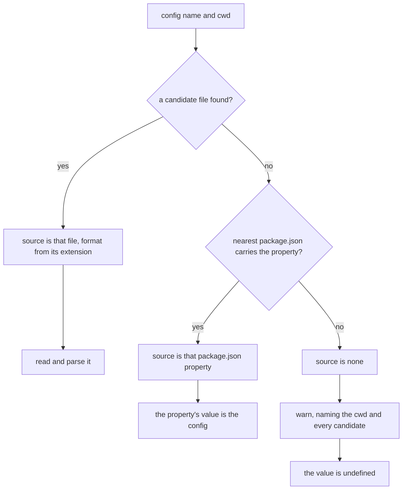
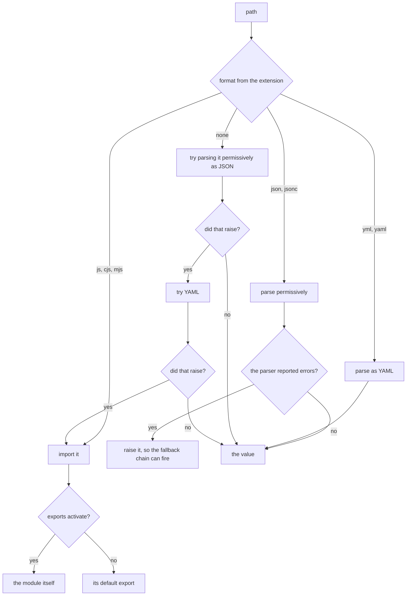
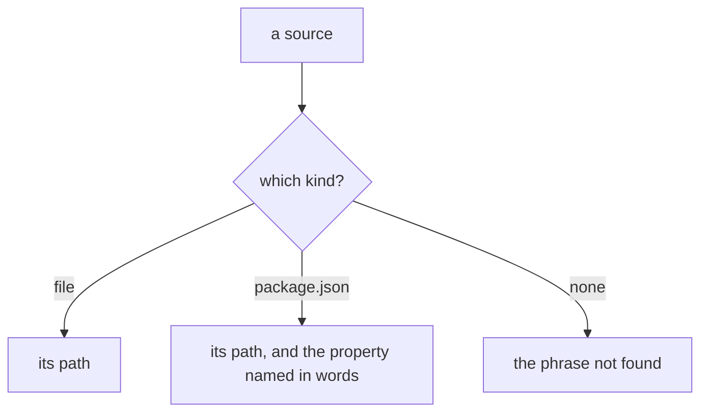

# Configuration

Governs `ts/config.ts`, `ts/find_up.ts`, and `ts/platform.ts` — locating a
configuration file by the supported filename conventions, reading its format,
and reporting where the value came from.

## What

A CLI that takes configuration has to answer a question its user rarely thinks
about until it goes wrong: *which* file did it read? This capability owns that
answer. It searches from the working directory upward for any of the filenames
the conventions allow, falls back to a property in the nearest `package.json`,
reads whatever it finds in whatever format that file is in, and reports the
origin alongside the value.

The search is **breadth-first by directory, not by candidate**: each ancestor
directory is read once and matched against every candidate name, so a config in
the nearest directory always wins and the filename order only breaks ties within
one directory. The alternative — one full walk per candidate name — would let a
`.foorc` three directories up beat a `foo.json` in the current one, which is not
what anyone means by "the nearest config".

Provenance is a first-class result rather than a debugging afterthought. "No
config found" and "a config that exists and holds nothing" are different
answers, and the type distinguishes them.

**Non-goals.** Validating the config against a command's schema belongs to
`execution/`, which owns the decision to load one at all. Printing the resolved
config belongs to `builtin-commands/` and `presentation/`. Reading the `plugins`
property to resolve packages belongs to `plugins/`.

**Key terms.** A **candidate** is one filename the search will accept. The
**source** is where a value came from — a file, a `package.json` property, or
nothing. A **format** is how a file's bytes are parsed; an **extension-less**
candidate such as `.foorc` carries no format hint, so its content decides.

## Use Cases

**Actors.**

| Actor | Reaches this capability | Goal |
| --- | --- | --- |
| CLI end user | places a config file and runs the CLI | have their file found wherever the conventions allow them to put it |
| `execution` | calls `loadConfig` / `resolveConfig` | get the config value, and its origin when it needs to report it |
| CLI author | declares `config` on the application | let their users configure the CLI without inventing a file format |
| A user debugging a config that was not picked up *(stakeholder)* | reads the warning and `--show-config` | learn which names were searched and which file won |

The debugging user is why the "nothing found" path lists every candidate it
looked for rather than simply reporting absence, and why the source is returned
rather than discarded once the value is read.

### UC1 — `lookupConfig`: find where the config would come from

**Actor / goal.** A caller wants the origin of the config without paying to read
it — enough to report, or to decide whether to read at all.

| | |
| --- | --- |
| Trigger | `lookupConfig({ cwd }, configName)` |
| Inputs | a working directory and the config name |
| Outcome | the source, plus the candidate list that was searched |

**Extensions.**

| Cause | Outcome |
| --- | --- |
| a matching file exists in an ancestor directory | the source is that file, with the format its extension implies |
| no file matches but the nearest `package.json` carries the property | the source is that `package.json` and its property |
| neither exists | the source is `none` — distinct from a file holding nothing |

### UC2 — `resolveConfig` / `loadConfig`: read the config

**Actor / goal.** `execution` wants the config value, and — for `resolveConfig` —
the origin to report alongside it.

| | |
| --- | --- |
| Trigger | `resolveConfig({ cwd, ui }, configName)`, or `loadConfig` for the value alone |
| Inputs | a working directory, a UI to log through, and the config name |
| Outcome | the parsed value and its source |

**Extensions.**

| Cause | Outcome |
| --- | --- |
| the source is a file | it is read and parsed by its format |
| the source is a `package.json` property | that property's value is the config |
| nothing was found | a warning names the directory and every candidate searched, and the value is undefined |

### UC3 — `getConfigFilenames`: enumerate the accepted names

**Actor / goal.** The search — and the warning that reports a failed one — needs
the ordered list of names a config may take.

| | |
| --- | --- |
| Trigger | `getConfigFilenames(configName)` |
| Inputs | the config name |
| Outcome | the candidate names in priority order |

**Extensions.** A config name already beginning with a dot is used as given; any
other name is expanded so each candidate has a dotted variant beside it, because
both `foo.json` and `.foo.json` are conventional.

### UC4 — `readConfigFile`: parse one file

**Actor / goal.** A caller holding a path wants its content as a value.

| | |
| --- | --- |
| Trigger | `readConfigFile(path)` |
| Inputs | the file's path |
| Outcome | the parsed value |

**Extensions.**

| Cause | Outcome |
| --- | --- |
| the extension names a module | it is imported; a module exporting `activate` yields the whole module, otherwise its default export |
| the extension names JSON(C) | parsed permissively — comments and trailing commas are allowed |
| the extension names YAML | parsed as YAML |
| the file has no format-bearing extension | JSON(C) is tried, then YAML, then module |
| JSON(C) parsing reports an error | it is raised as a throw, because the underlying parser **recovers** instead of throwing — a JS module would otherwise parse to an empty object and a YAML list to its first scalar, and the fallback chain above would never fire |

### UC5 — `findAnyFileUp` / `findFileUp`: walk ancestors for a file

**Actor / goal.** The lookup wants the nearest ancestor directory holding any of
several filenames, at one directory read per directory.

| | |
| --- | --- |
| Trigger | `findAnyFileUp(cwd, filenames)`, or `findFileUp` for a single name |
| Inputs | a starting directory and the names to accept |
| Outcome | the path of the first match, or nothing |

**Extensions.**

| Cause | Outcome |
| --- | --- |
| a directory cannot be read | it is skipped and the walk continues upward |
| the platform's filesystem is case-insensitive | a differently-cased name matches, but an exact name always wins over it |
| the match is a symlink | it counts when it points at a file |
| the match is a directory | it does not count |
| the walk reaches the filesystem root | it stops there |

### UC6 — `describeConfigSource`: render a source for a reader

**Actor / goal.** `--show-config` wants one human-readable line naming where the
config came from.

| | |
| --- | --- |
| Trigger | `describeConfigSource(source)` |
| Inputs | a source |
| Outcome | one line |

**Extensions.** A `package.json` source names its property as well as its path,
since the path alone would not say which key was read; nothing found renders as
a phrase rather than an empty string.

**Surface trace.**

| Element | Required by | May not combine with |
| --- | --- | --- |
| `lookupConfig` | UC1 | — |
| `resolveConfig` / `loadConfig` | UC2 | — |
| `getConfigFilenames` | UC3 | — |
| `getConfigFormat` | UC1, UC4 | — |
| `readConfigFile` | UC4 | — |
| `findAnyFileUp` / `findFileUp` | UC5 | — |
| `describeConfigSource` | UC6 | — |
| `ConfigSource` / `ConfigFormat` / `ConfigLookupResult` / `ConfigLoadResult` | UC1, UC2 | — |
| `findPackageJson` / `getPackageJson` | UC1, UC2 | — |

## Control Flow

### Sub-graph A — candidate names (`getConfigFilenames`), entered by UC3

### Sub-graph B — search (`findAnyFileUp`), entered by UC5

Every candidate is tried in the current directory before the walk moves up, so
the nearest directory wins and candidate order only breaks ties within one.

The exact-name lookup runs first on every platform, which is what makes an
exactly-named file win over a differently-cased one rather than the two racing.

### Sub-graph C — locate and read (`lookupConfig` → `resolveConfig`), entered by UC1 and UC2

### Sub-graph D — parse one file (`readConfigFile`), entered by UC4

The permissive JSON parser recovers from syntax errors rather than throwing, so
the raise is what makes the fallback chain work at all — without it a JS module
would parse to `{}` and be accepted. The last fallback, importing an
extension-less file as a module, is drawn because it is a real edge but carries
**no scenario**: a file with no extension cannot be `import()`ed by name, so it
is unreachable for anything the search could have found.

### Sub-graph E — describe a source (`describeConfigSource`), entered by UC6

## Scenario map

### UC1 — `lookupConfig`

| Edge | Path (Given) | Scenario |
| --- | --- | --- |
| source is that file, format from its extension | a candidate file exists in an ancestor | `a config file in an ancestor directory is the source` |
| source is that package.json property | no file, the property is present | `a package.json property is the source when no config file matches` |
| source is none | neither exists | `nothing found is reported as a source of its own` |

### UC2 — `resolveConfig` / `loadConfig`

| Edge | Path (Given) | Scenario |
| --- | --- | --- |
| read and parse it | the source is a file | `a file source is read and parsed into the config value` |
| the property's value is the config | the source is a package.json | `a package.json source yields that property's value` |
| warn, naming the cwd and every candidate | the source is none | `nothing found warns with the directory and every name searched` |
| the value is undefined | the source is none | `nothing found yields an undefined config` |

### UC3 — `getConfigFilenames`

| Edge | Path (Given) | Scenario |
| --- | --- | --- |
| the base names, as given | the name begins with a dot | `a config name already beginning with a dot is used as given` |
| each base name, followed by its dotted variant | the name has no leading dot | `a plain config name also accepts its dotted variants` |

### UC4 — `readConfigFile`

| Edge | Path (Given) | Scenario |
| --- | --- | --- |
| the module itself | a module exporting `activate` | `a module config exporting activate yields the whole module` |
| its default export | a module without `activate` | `a module config without activate yields its default export` |
| parse permissively | a `.json` or `.jsonc` file | `a JSON config accepts comments and trailing commas` |
| parse as YAML | a `.yml` or `.yaml` file | `a YAML config is parsed as YAML` |
| did that raise? — no, after JSON | an extension-less file holding JSON | `an extension-less config holding JSON is parsed as JSON` |
| did that raise? — yes, then YAML | an extension-less file holding YAML | `an extension-less config holding YAML falls through to YAML` |
| raise it | JSON parsing reported an error | `a JSON config the parser could not read raises rather than returning a recovered value` |

### UC5 — `findAnyFileUp` / `findFileUp`

| Edge | Path (Given) | Scenario |
| --- | --- | --- |
| return its path | a match in the starting directory | `a file in the starting directory is found` |
| move to the parent | no match until an ancestor | `the walk continues upward until a directory matches` |
| another candidate? — yes | two candidates in the same directory | `two candidates in one directory are settled by candidate order` |
| another candidate? — no, then move to the parent | candidates in two directories | `a later candidate in a nearer directory beats an earlier one further up` |
| readable? — no | a directory cannot be read | `an unreadable directory is skipped rather than ending the walk` |
| an entry named exactly that? — yes | case-insensitive platform, both cases present | `an exactly-named file wins over a differently-cased one` |
| an entry whose lower-cased name matches? — yes | case-insensitive platform, only the other case present | `a differently-cased file matches on a case-insensitive filesystem` |
| case-insensitive platform? — no | only the other case present | `a differently-cased file does not match on a case-sensitive filesystem` |
| symlink to a file | the match is a symlink to a file | `a symlink pointing at a file counts as a match` |
| a directory or a dangling symlink | the match is a directory | `a directory sharing a candidate's name is not a match` |
| no match | the walk reached the root | `a walk reaching the filesystem root with no match returns nothing` |

### UC6 — `describeConfigSource`

| Edge | Path (Given) | Scenario |
| --- | --- | --- |
| its path | a file source | `a file source is described by its path` |
| its path, and the property named in words | a package.json source | `a package.json source names the property as well as the path` |
| the phrase not found | no source | `an absent source is described in words rather than left blank` |
