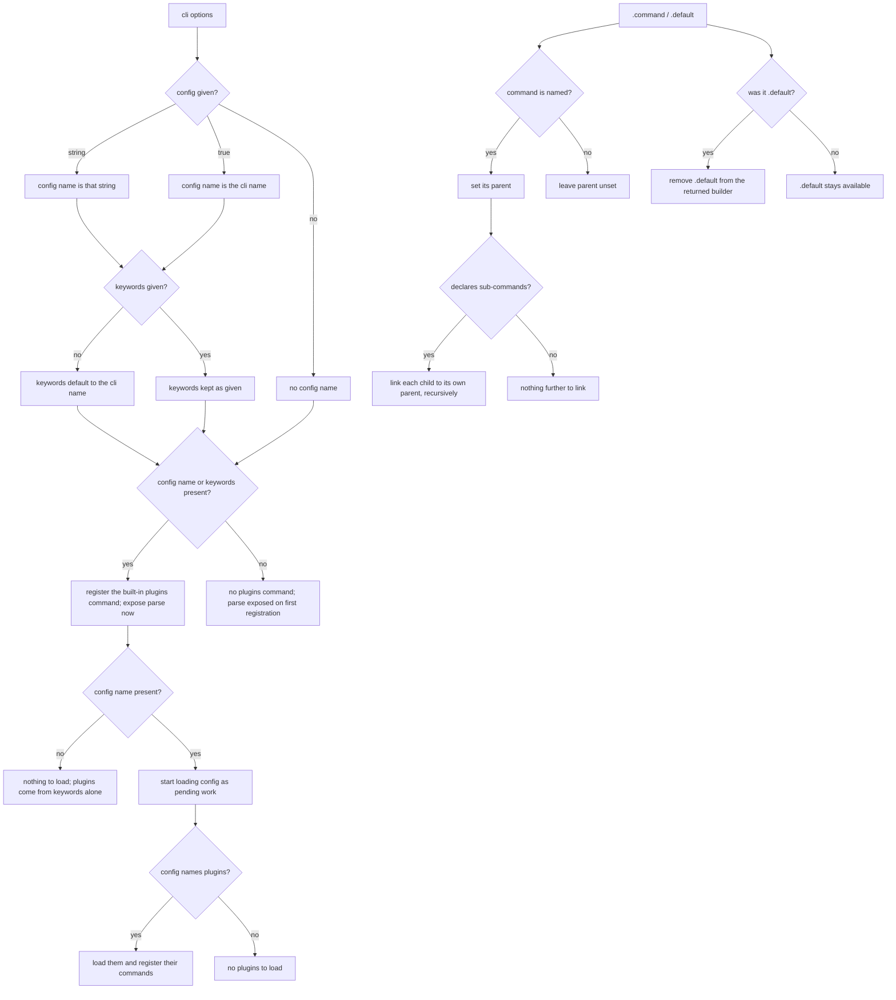
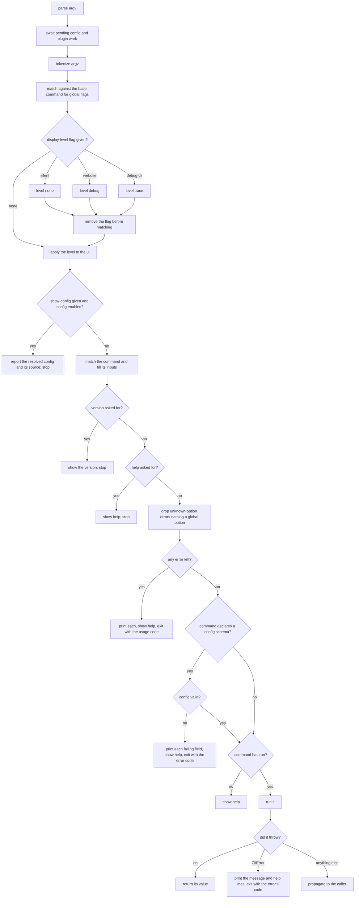
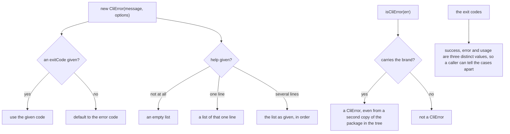
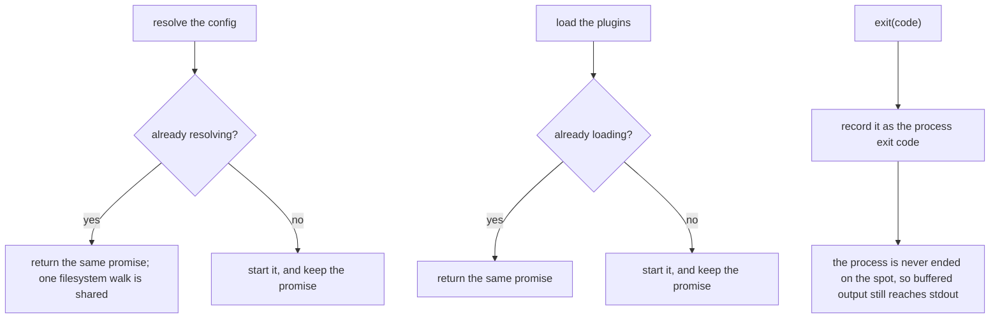

# Execution

Governs `ts/cli.ts`, `ts/app/`, and `ts/drivers/context.ts`
— assembling an application from its declarations, running the matched command
with its context, and reporting failure as an exit code.

## What

This is the capability that turns a pile of declarations into a running
program. It has two halves separated in time. **Assembly** happens when the
author calls `cli(options)` and registers commands: state is derived from the
options, the built-in commands are installed, and any configuration and plugin
loading is started. **Invocation** happens when `parse(argv)` is called: the
global flags are answered, a command is matched, its inputs are checked, and it
is either run or refused.

Two design decisions run through the whole node. **Global flags are answered
before usage errors** — `--help` and `--version` are always valid, and telling a
confused user "unknown option" when they asked for help would be exactly
backwards. And **failure is an exit code, not an exception**: `parse` resolves
rather than rejecting, so a wrong invocation is reported to the user instead of
surfacing as an unhandled rejection with a stack trace.

The exit codes are the contract with a **non-human caller**. They follow the AXI
convention so that an agent or a script driving the CLI through a shell can tell
apart the three outcomes that matter — it worked, it was called correctly but
could not finish, it was called wrong and retrying identically will not help.

**Non-goals.** Classifying argv and coercing values belong to `input-parsing/`.
Finding and reading a config file belongs to `configuration/`; this node only
decides *when* to load one and what to do when it fails validation. Resolving
plugin packages belongs to `plugins/`. Rendering help text and messages belongs
to `presentation/`. What the built-in commands *do* belongs to
`builtin-commands/`.

**Key terms.** The **base command** is the invisible root carrying the global
options; every application has one. **Assembly** is everything before `parse`;
**pending work** is the config and plugin loading started during assembly that
`parse` must await. A **command instance** is a matched declaration bound to its
`ui`, `config`, `keywords`, `cwd`, and `registry`.

## Use Cases

**Actors.**

| Actor | Reaches this capability | Goal |
| --- | --- | --- |
| CLI author | `cli(options)`, `.command()`, `.default()`, `parse(argv)` | assemble an application from declarations and hand it argv |
| Command author | throws `CliError` from `run` | fail the CLI with a message the user can act on, and a chosen exit code |
| CLI end user | invokes the built program | reach the command they meant, or be told what was wrong and how to fix it |
| Agent or script driving the CLI through a shell | reads the process exit code | tell "it worked" from "it failed" from "I called it wrong" without parsing prose |
| `configuration` / `plugins` | are called during assembly and parse | be asked for their work once, at the right moment |

The agent is the stakeholder that justifies the three-way exit code split; a
capability reporting only success-or-failure would serve the human user equally
well and leave the agent unable to decide whether to retry.

### UC1 — `cli`: assemble an application

**Actor / goal.** A CLI author wants a runnable application derived from a name,
a version, and a statement of whether it takes configuration or plugins.

| | |
| --- | --- |
| Trigger | `cli(options)` |
| Inputs | `name`, `version`, optional `description`, `config`, `keywords` |
| Outcome | a builder; when the application can accept plugins, it is already executable |

**Extensions.**

| Cause | Outcome |
| --- | --- |
| `config` is `true` | the config name is the CLI's own name |
| `config` is a string | that string is the config name |
| `config` is set and no keywords are given | the keywords default to the CLI's name, so plugin discovery has something to search for |
| the application can accept plugins | the built-in `plugins` command is registered, and `parse` is available immediately |
| the application takes neither config nor keywords | no `plugins` command, and `parse` becomes available only once a command is registered |
| a loaded config names plugins | their commands are registered before `parse` proceeds |

### UC2 — `.command()` / `.default()`: register commands

**Unserved goal — recovered from the issue tracker.** It has no entry point
today, so it appears in neither the Control Flow nor the suite:

| Actor | Goal | Provenance |
| --- | --- | --- |
| CLI author | be warned when a registered command's name or alias collides with an existing one, rather than silently having the first match win | [#109](https://github.com/clibuilder/clibuilder/issues/109) — closed without an implementation; no conflict detection exists in `ts/app/` or `ts/invocation/` |

**Actor / goal.** A CLI author wants their declarations installed into the
application's tree, with each command's place in that tree recorded.

| | |
| --- | --- |
| Trigger | `.command(cmd)` or `.default(cmd)` |
| Inputs | a command declaration |
| Outcome | the command is registered, its `parent` set, and the builder is executable |

**Extensions.** `.default()` may be called only once — the method is removed
from the builder it returns, so a second call is not offered. A registered
command's nested sub-commands are linked to their own parent recursively, not
to the root.

### UC3 — `parse`: run an invocation

**Actor / goal.** An end user wants the command they named to run with the
inputs they gave, or to be told precisely what was wrong.

| | |
| --- | --- |
| Trigger | `parse(argv)` |
| Inputs | the raw argv vector |
| Outcome | the matched command's return value |

**Extensions.**

| Cause | Outcome |
| --- | --- |
| a display-level flag is given | the level is set and the flag is removed before the command is matched, so it is never reported as unknown |
| `--show-config` on an application that takes config | the resolved config and its source are reported, and no command runs |
| `--show-config` on an application that takes no config | the option was never declared, so it is a usage error like any other unknown option |
| `--version` on the base command or the matched one | the version is shown, and no command runs |
| `--help` on the base command or the matched one | help is shown, and no command runs — **before** any usage error is reported |
| an unknown-option error names a global option | it is dropped: the global options live on the base command, so a sub-command declaring none of its own would otherwise report them as unknown |
| any usage error survives that filter | every error is printed, help is shown, and the CLI exits with the usage code |
| the matched command declares a config schema and the config fails it | each failing field is printed, help is shown, and the CLI exits with the error code |
| the matched command has no `run` | help is shown — a group command is not a runnable command |
| `run` throws a `CliError` | its message and help lines are printed and the CLI exits with the error's own code |
| `run` throws anything else | it propagates to the caller — a defect in the command is not the framework's to swallow |

### UC4 — `CliError` and the exit codes: report a failure

**Actor / goal.** A command author wants to fail the CLI with a message,
optional guidance, and an exit code that says which kind of failure it was.

| | |
| --- | --- |
| Trigger | `throw new CliError(message, options)` from `run` |
| Inputs | a message; optionally an exit code, help lines, and a cause |
| Outcome | the message and help are printed, and the process exit code is set |

**Extensions.** The exit code defaults to the error code when none is given.
`help` may be one line or many and is normalized to a list. `isCliError` tests a
**brand**, not the class, so an error thrown by a duplicated copy of
`clibuilder` in the dependency tree is still recognized.

### UC5 — `context`: reach the outside world once

**Actor / goal.** The builder wants filesystem, process, and logging access it
can substitute in tests, and wants expensive resolution done once.

| | |
| --- | --- |
| Trigger | `context()` at construction |
| Inputs | the process's working directory |
| Outcome | a context carrying `cwd`, config and plugin loading, `exit`, and UI factories |

**Extensions.** Config resolution is cached **as a promise**, so concurrent
callers share one filesystem walk and a config that is legitimately falsy is not
re-resolved on every call. `exit` **records** `process.exitCode` rather than
calling `process.exit`, which would end the process on the spot and truncate
whatever is still buffered on stdout.

**Surface trace.**

| Element | Required by | May not combine with |
| --- | --- | --- |
| `cli.Options.name` / `.version` | UC1 | — |
| `cli.Options.description` | UC1 (help text) | — |
| `cli.Options.config` | UC1, UC3 (`--show-config`) | — |
| `cli.Options.keywords` | UC1 (plugin discovery) | — |
| `.command` / `.default` | UC2 | `.default` with itself — offered once |
| `parse` | UC3 | — |
| `exitCodes` | UC4 | — |
| `CliError` and its options | UC4 | — |
| `isCliError` | UC4 | — |
| `context().exit` / `.resolveConfig` / `.loadPlugins` | UC5 | — |

## Control Flow

### Sub-graph A — assembly, entered by UC1 and UC2

### Sub-graph B — invocation (`parse`), entered by UC3

### Sub-graph D — failing on purpose (`CliError`, `exitCodes`), entered by UC4

The brand is a shared symbol rather than the class, which is what makes the
check survive a duplicated `clibuilder` in the dependency tree — `instanceof`
would be comparing two different classes there.

### Sub-graph E — the outside world (`context`), entered by UC5

The cache holds the **promise**, not the resolved value, which is what makes it
correct for a config that is legitimately falsy as well as for concurrent
callers.

## Scenario map

### UC1 — `cli`: assemble an application

| Edge | Path (Given) | Scenario |
| --- | --- | --- |
| config name is that string | `config` is a string | `a string config option names the config file` |
| config name is the cli name | `config` is true | `config given as true names the config after the cli` |
| no config name | `config` omitted | `an application declaring no config has no config name` |
| keywords default to the cli name | config set, keywords omitted | `an application with config and no keywords searches under its own name` |
| keywords kept as given | keywords declared | `declared keywords are kept as given` |
| register the built-in plugins command; expose parse now | config name or keywords present | `an application that can accept plugins gets the built-in plugins command` |
| no plugins command | neither config nor keywords | `an application that cannot accept plugins gets no plugins command` |
| start loading config as pending work | a config name | `parse waits for the config started during assembly` |
| load them and register their commands | the loaded config names plugins | `commands from configured plugins are registered before parse proceeds` |

### UC2 — register commands

| Edge | Path (Given) | Scenario |
| --- | --- | --- |
| set its parent | a named command registered | `a registered command records its parent` |
| leave parent unset | a command with no name | `a nameless command records no parent` |
| link each child to its own parent, recursively | a registered command declaring sub-commands | `nested sub-commands are linked to their own parent, not the root` |
| remove `.default` | `.default` was called | `the default command may be registered only once` |
| parse exposed on first registration | an application that cannot accept plugins | `registering a command makes the application executable` |

### UC3 — `parse`: run an invocation

| Edge | Path (Given) | Scenario |
| --- | --- | --- |
| level none, flag removed | `--silent` | `silent turns logging off and is not reported as unknown` |
| level debug, flag removed | `--verbose` | `verbose raises the log level and is not reported as unknown` |
| level trace, flag removed | `--debug-cli` | `debug-cli turns on framework logging and is not reported as unknown` |
| report the config and its source | `--show-config`, config enabled | `show-config reports the resolved config and where it came from` |
| show-config given and config enabled? — no | `--show-config`, config not enabled | `show-config on an application without config is an unknown option` |
| show the version | `--version` on the base command | `version asked of the application shows its version` |
| show the version | `--version` on the matched command | `version asked of a matched command shows the application version` |
| show help | `--help`, with no other error | `help asked for shows help and runs nothing` |
| show help | `--help`, with a usage error also present | `help is answered even when the invocation is otherwise wrong` |
| drop unknown-option errors naming a global option | a sub-command declaring no options, given a global flag | `a global option given to a sub-command is not reported as unknown` |
| print each, show help, exit usage | an unknown option that is not global | `a usage error is printed with help and exits with the usage code` |
| print each failing field, exit error | matched command declares config, config invalid | `a config failing the command's schema is reported field by field` |
| command declares a config schema? — no | matched command declares no config schema | `a command declaring no config schema does not validate the config` |
| show help | matched command has no `run` | `a group command with nothing to run shows help` |
| return its value | a runnable command, no errors | `a matched command runs and its value is returned` |
| print the message and help lines; exit with the error's code | `run` throws `CliError` | `a command failing with CliError is reported and sets its exit code` |
| propagate | `run` throws anything else | `a command throwing anything else propagates to the caller` |

### UC4 — `CliError` and the exit codes

| Edge | Path (Given) | Scenario |
| --- | --- | --- |
| default to the error code | no exit code given | `a CliError with no exit code uses the error code` |
| use the given code | an exit code given | `a CliError carries the exit code it was given` |
| an empty list | no help given | `a CliError with no help carries an empty list` |
| a list of that one line | help given as one line | `a single help line is carried as a list of one` |
| the list as given, in order | help given as several lines | `several help lines are carried in order` |
| carries the brand? — yes | an error from a duplicated copy of the package | `an error from a second copy of clibuilder is still recognized` |
| carries the brand? — no | a plain Error | `an ordinary error is not mistaken for a CliError` |
| success, error and usage are three distinct values | any | `success, error, and usage are three distinct exit codes` |

### UC5 — `context`

| Edge | Path (Given) | Scenario |
| --- | --- | --- |
| return the same promise; one filesystem walk is shared | config already being resolved | `concurrent config resolution shares one filesystem walk` |
| start it, and keep the promise | config not yet being resolved | `the first config resolution starts the walk and keeps its promise` |
| return the same promise | plugins already being loaded | `concurrent plugin loading shares one activation pass` |
| record it as the process exit code | `exit` called | `exiting records the code rather than ending the process` |
