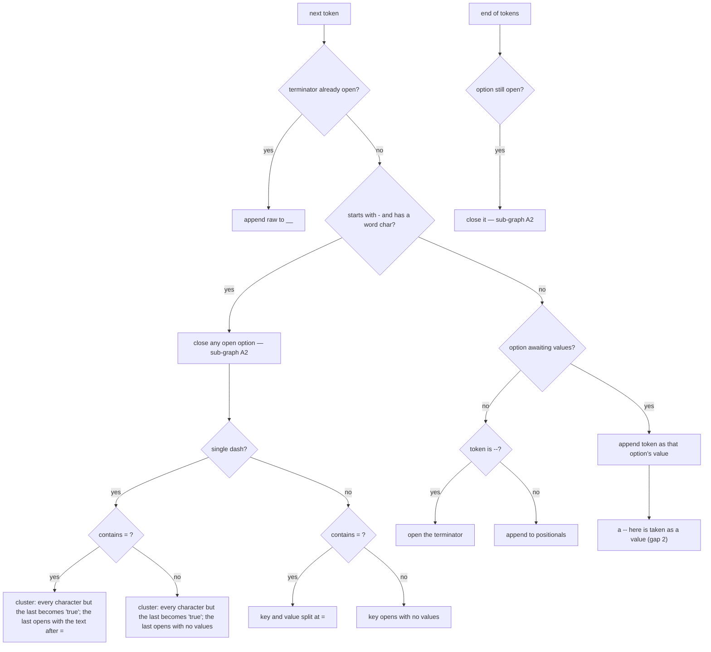
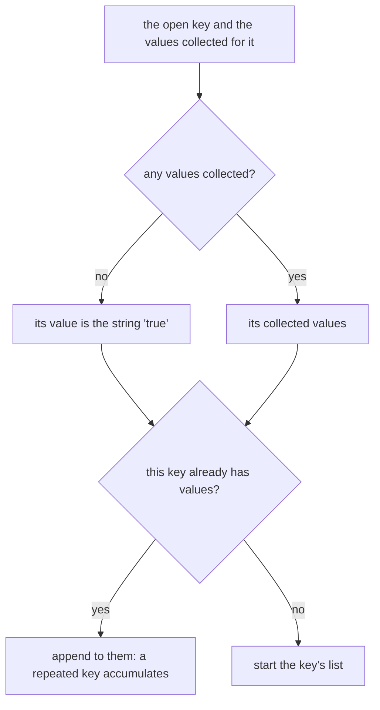
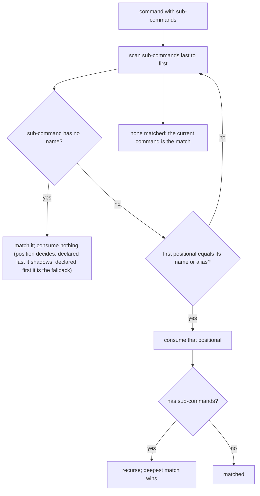
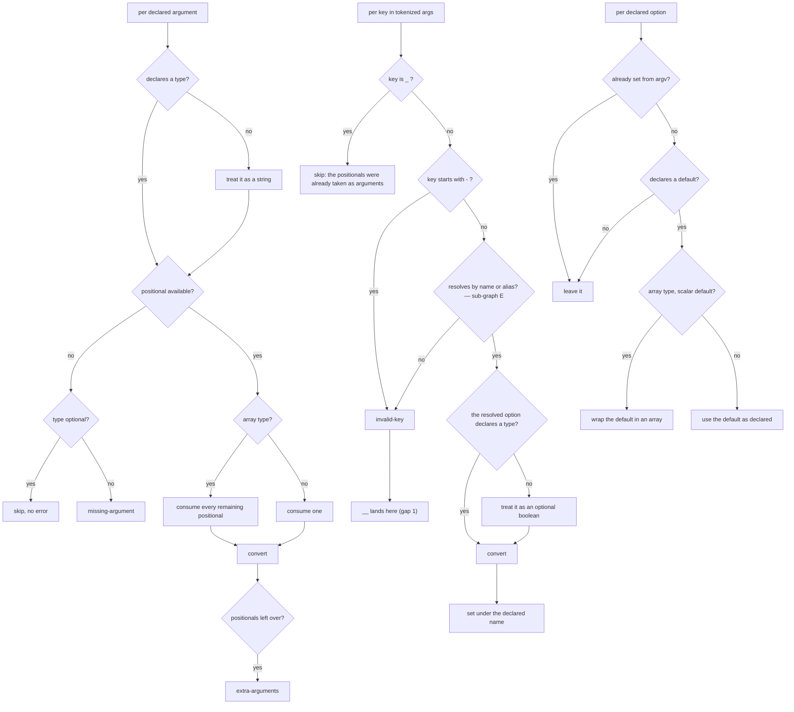
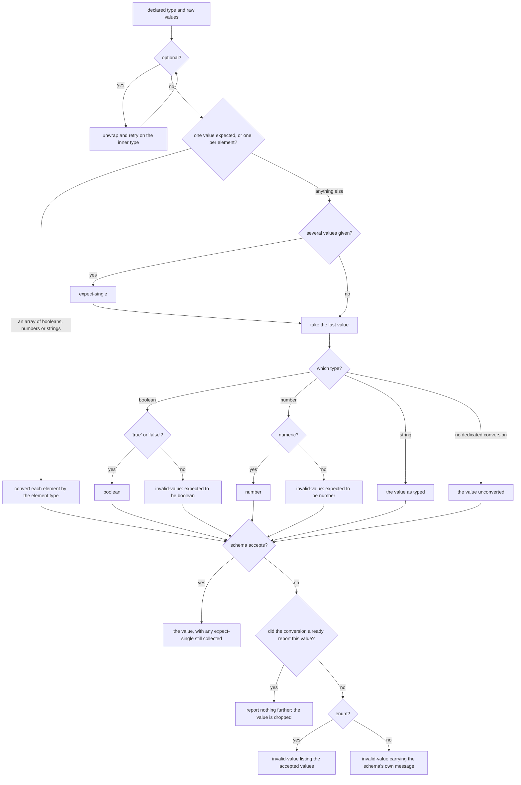
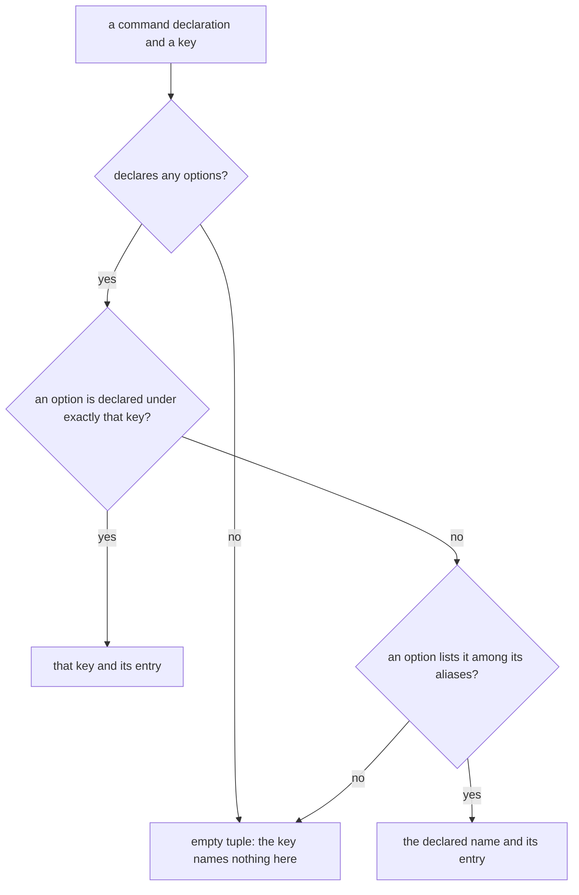

# Input parsing

Governs `ts/argv.ts` and `ts/lookup_command.ts` — classifying an argv vector,
matching it against the declared command tree, and coercing and validating each
raw string into the declared argument and option types.

## What

An operating system hands a CLI an array of strings. This capability turns that
array into the three things the rest of the framework needs: **which** command
was invoked, **what** its inputs are as declared types rather than strings, and
**what was wrong** with the invocation. It is the only place raw argv is
interpreted.

The work happens in three stages, and the split matters because each has a
different notion of correctness. **Tokenizing** is pure shape — it knows nothing
about which command is running, so it cannot tell a typo from a valid option and
never reports an error. **Matching** walks the declared tree to find the command
the user meant. **Filling** is the only stage that consults the declaration, so
it is the only stage that can judge an input wrong.

Errors are **collected, not thrown**. A single invocation can be wrong in
several ways at once, and reporting them together is what lets a user fix an
invocation in one pass instead of one round-trip per mistake.

**Non-goals.** What may be declared belongs to `command-definition/`. Deciding
what to do with the collected errors — printing them, choosing an exit code —
belongs to `execution/` and `presentation/`. Configuration files are read by
`configuration/`, not from argv.

**Key terms.** A **token** is one element of argv after the node binary and
script path are dropped. **Option state** is the tokenizer awaiting values for
an option it has just opened. The **terminator** is `--`, after which tokens are
meant to be passed through raw. A **variadic** argument is one declared with an
array type; it consumes every remaining positional.

## Use Cases

**Actors.**

| Actor | Reaches this capability | Goal |
| --- | --- | --- |
| CLI end user | types an invocation | reach the command they meant with the values they meant, or be told precisely what was wrong |
| `execution` | calls `lookupCommand(command, args)` | get a matched command, typed args, and an error list to act on |
| `execution`, again | calls `lookupOptions(baseCommand, key)` | keep a valid global flag from being reported as a usage error when the sub-command it was typed against declares no options of its own |
| `presentation` | reads the returned errors | render each failure in the user's terms |
| CLI author *(stakeholder — never invokes this node)* | — | the types they declared are the types `run` receives |

### UC1 — `parseArgv`: classify an argv vector into positionals and option values

**Actor / goal.** `execution` wants argv reduced to shape — positionals, option
keys with their values, and any terminator remainder — before any declaration is
consulted.

| | |
| --- | --- |
| Trigger | `parseArgv(argv)` |
| Inputs | the raw argv array; the first two elements (node binary, script) are dropped |
| Outcome | `{ _: positionals, __?: raw remainder, ...key: values }` |

**Extensions.**

| Cause | Outcome |
| --- | --- |
| an option is opened and never given a value | its value is the string `'true'` |
| the same option key appears more than once | the values accumulate under that key |
| a single-dash token clusters several characters (`-abc`) | all but the last are `'true'`; the last opens for values |
| a token begins with `-` but contains no word character (`-`) | it is a positional, not an option |
| a token is `-5` | **it opens an option named `5`** — a negative number cannot be given as a value; see the gaps below |
| `--` arrives while an option is awaiting values | **it is consumed as that option's value** and no terminator is opened; see the gaps below |

This stage reports **no errors** — it cannot, having never seen a declaration.

### UC2 — `lookupCommand`: match a command and fill its declared inputs

**Actor / goal.** `execution` wants the deepest command the invocation names,
with every declared argument and option converted to its declared type and every
failure collected.

| | |
| --- | --- |
| Trigger | `lookupCommand(command, args)` |
| Inputs | the root command declaration and the tokenized args |
| Outcome | `{ command, args, errors }` — errors empty on a clean invocation |

**Extensions.**

| Cause | Outcome |
| --- | --- |
| no sub-command matches the first positional | the current command is the match; positionals stay for its arguments |
| a required argument has no positional left | `missing-argument` |
| positionals remain after every declared argument is filled | `extra-arguments` |
| an option key matches no declared name or alias | `invalid-key` |
| a key retains a leading dash (from `---abc`) | `invalid-key` |
| the terminator was used | **`invalid-key` for `__`, and the remainder is dropped**; see the gaps below |
| a value cannot be converted to its declared type | `invalid-value`, carrying what the option would have accepted |
| several values are given for a single-valued option | `expect-single`, and the last value is used |

### UC3 — `lookupOptions`: decide whether a key names a declared option

**Actor / goal.** `execution` holds a key that the matched command reported as
unknown, and wants to know whether it is in fact one of the application's global
options — declared on the base command rather than on the sub-command the user
typed it against. A global flag is always accepted, so answering yes is what
keeps `--verbose` on a sub-command from being reported as a usage error. The
declared name comes back with the entry, so a key typed as an alias lands under
the name its author declared.

| | |
| --- | --- |
| Trigger | `lookupOptions(command, key)` |
| Inputs | a command declaration and a key as the user typed it |
| Outcome | `[name, entry]` — the declared name and the option it names |

**Extensions.**

| Cause | Outcome |
| --- | --- |
| the command declares no options at all | an empty tuple; the key names nothing here |
| the command declares options, none matching by name or alias | an empty tuple; the key names nothing here |

The same decision is how UC2 fills an option from argv, so it is drawn once — as
sub-graph E — and both enter it. What a caller does with an empty tuple is the
caller's: UC2 raises `invalid-key`, and `execution` keeps the error it already
had.

**Known gaps.** Three tokenizer/filler decisions below are current behavior that
the suite fixes as-is; each is filed as a defect in this spec's ledger.

1. **The terminator is unreachable.** `fillInputOptions` skips the `_` key but
   not `__`, so any invocation using `--` reports `invalid-key: __` and the raw
   remainder never reaches `run` — even though `lookupCommand.Result` declares
   an `__?: string[]` field for it.
2. **`--` after an open option is swallowed.** `isOption('--')` is false (no word
   character), so the tokenizer's option-state branch claims it before the
   terminator branch is reached: `--opt -- abc` yields `opt: ['--', 'abc']`.
3. **A negative number is read as an option.** `isOption('-5')` is true, so `-5`
   opens an option named `5`. A command declaring a number argument cannot be
   given a negative value.

**Surface trace.**

| Element | Required by | May not combine with |
| --- | --- | --- |
| `parseArgv` | UC1 | — |
| `parseArgv.Result._` / `.__` | UC1 | — (`__` is presently unreadable downstream — gap 1) |
| `lookupCommand` | UC2 | — |
| `lookupCommand.Result.errors` and its five error types | UC2 | — |
| `lookupOptions` | UC3, and internally by UC2's filling step | — |

## Control Flow

### Sub-graph A — tokenize (`parseArgv`), entered by UC1

Each character a cluster sets to `'true'` is closed through A2 in turn, so a
repeated character accumulates like any other repeated key.

### Sub-graph A2 — close an option, entered from A

### Sub-graph B — match (`matchCommand`), entered by UC2

### Sub-graph C — fill (`processCommand`), entered by UC2

Runs in a fixed order: arguments, then options from argv, then defaults.

### Sub-graph D — convert (`convertValue`), entered from C

Conversion runs in two stages, and every path passes through both. First the raw
strings are turned into JavaScript values by the declared type's shape; then the
declared schema itself is asked to accept the result. The second stage is what
catches a type the first stage has no conversion for — an enum most of all.

### Sub-graph E — resolve a key (`lookupOptions`), entered by UC3 and from C

An alias may be written as a bare string or as `{ alias, hidden }`; both forms
are matched, and `hidden` affects only how `presentation/` lists it.

## Scenario map

### UC1 — `parseArgv`

| Edge | Path (Given) | Scenario |
| --- | --- | --- |
| key and value split at `=` | long option | `a long option written with = takes the text after it as its value` |
| key opens with no values | long option, next token is a positional | `a long option takes the following token as its value` |
| no values collected: `'true'` (A2) | option is last, or followed by another option | `an option given no value becomes true` |
| append to them: a repeated key accumulates (A2) | the same key opened twice | `an option repeated accumulates its values` |
| cluster: every character but the last becomes `'true'` | single dash, several characters | `a single-dash cluster sets every character but the last to true` |
| cluster with `=`: the last character opens with the text after it | single dash, several characters, `=` | `a single-dash cluster with = gives its value to the last character` |
| append to positionals | no option awaiting values | `a bare token is a positional` |
| starts with `-`, no word char | token is a lone dash | `a lone dash is a positional, not an option` |
| starts with `-`, has a word char | token is a negative number | `a negative number opens an option named by its digits` |
| open the terminator | no option awaiting values | `a terminator collects every following token raw` |
| append token as that option's value | an option is awaiting values | `a terminator arriving while an option is open becomes that option's value` |
| append raw to `__` | terminator already open | `a token shaped like an option after the terminator is kept raw` |

### UC2 — `lookupCommand`, matching

| Edge | Path (Given) | Scenario |
| --- | --- | --- |
| first positional equals its name | a declared sub-command | `an invocation naming a sub-command matches it and consumes its name` |
| first positional equals an alias | a declared sub-command with an alias | `an invocation naming a sub-command's alias matches it` |
| none matched | sub-commands declared, none named | `an invocation naming no sub-command matches the command itself` |
| sub-command has no name | declared before its named siblings, none of which match | `a nameless sub-command matches without consuming a positional` |
| sub-command has no name | declared after its named siblings | `a nameless sub-command declared last shadows its named siblings` |
| recurse, deepest match wins | a matched sub-command that itself nests | `an invocation naming a nested path matches the deepest command` |
| scan last to first | two sub-commands declared under one name | `the later of two sub-commands sharing a name wins` |

### UC2 — `lookupCommand`, filling

| Edge | Path (Given) | Scenario |
| --- | --- | --- |
| consume one | a non-array argument with a positional available | `a declared argument takes the next positional` |
| consume every remaining positional | an array-typed argument | `an array argument consumes every remaining positional` |
| `missing-argument` | a required argument with no positional left | `a required argument with nothing left reports it missing` |
| skip, no error | an optional argument with no positional left | `an optional argument with nothing left is skipped without error` |
| `extra-arguments` | every declared argument filled, positionals remain | `positionals left over after every argument are reported as extra` |
| treat it as a string | an argument declaring no type | `an argument declaring no type is filled as a string` |
| skip: the positionals were already taken as arguments | positionals were given | `the positionals key is not reported as an unknown option` |
| set under the declared name | key matches an option name | `an option key matching a declared name is filled` |
| set under the declared name | key matches an alias | `an option key matching an alias is filled under the declared name` |
| `invalid-key` | key matches no name or alias | `an unknown option key is reported as invalid` |
| `invalid-key` | key retains a leading dash | `an option written with three dashes is reported as invalid` |
| `invalid-key` | the terminator was used | `an invocation using the terminator reports it as an invalid key` |
| treat it as an optional boolean | an option declaring no type | `an option declaring no type is filled as an optional boolean` |
| use the default as declared | a declared option absent from argv | `an absent option falls back to its declared default` |
| wrap the default in an array | an array-typed option with a scalar default | `a scalar default on an array option is wrapped in an array` |
| leave it | a declared option present in argv | `an option given in argv is not overwritten by its default` |

### UC2 — `lookupCommand`, converting

| Edge | Path (Given) | Scenario |
| --- | --- | --- |
| `'true'` or `'false'?` — yes | boolean type | `a boolean option accepts true and false` |
| `invalid-value: expected to be boolean` | boolean type | `a boolean option given another word is rejected as not a boolean` |
| numeric? — yes | number type | `a number option accepts a numeric value` |
| `invalid-value: expected to be number` | number type | `a number option given a non-numeric value is rejected as not a number` |
| the value as typed | string type | `a string option takes its value as typed` |
| convert each element by the element type | array type | `an array option converts each of its values by the element type` |
| unwrap and retry on the inner type | optional type | `an optional option converts by the type it wraps` |
| `expect-single` | any single-valued type | `several values for a single-valued option are reported, and the last one is used` |
| the value unconverted, then the schema accepts | enum type given a declared value | `an enum option given one of its declared values is accepted as typed` |
| `invalid-value` listing the accepted values | enum type the schema rejected | `an enum option given an unlisted value is told which values it accepts` |
| `invalid-value` carrying the schema's own message | non-enum type the schema rejected | `a value the schema rejects is reported in the schema's own words` |
| report nothing further; the value is dropped | the conversion already rejected the value | `a value the conversion rejected is reported once, not twice` |

### UC3 — `lookupOptions`

| Edge | Path (Given) | Scenario |
| --- | --- | --- |
| an option is declared under exactly that key? — yes | the command declares the option | `a key matching a declared name resolves to that option` |
| an option lists it among its aliases? — yes | the option declares that alias as a plain string | `a key matching an alias resolves to the option's declared name` |
| an option lists it among its aliases? — yes | the option declares that alias in its hidden form | `a key matching a hidden alias resolves like any other alias` |
| empty tuple: the key names nothing here | the command declares no options at all | `a key looked up on a command declaring no options resolves to nothing` |
| empty tuple: the key names nothing here | the command declares options, none matching | `a key matching neither a name nor an alias resolves to nothing` |
