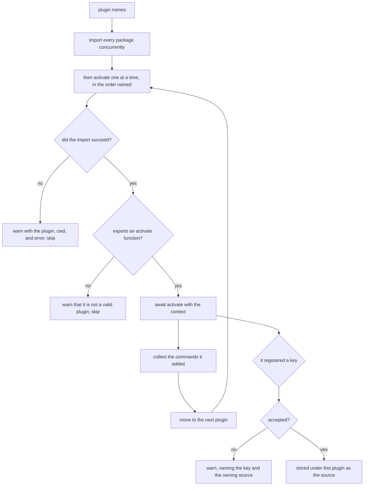
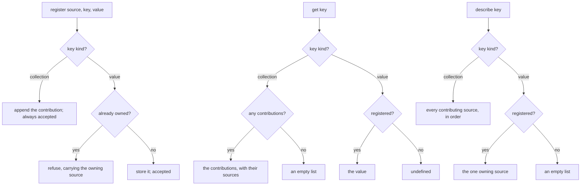

# Plugins

Governs `ts/plugins.ts` and `ts/registry.ts` — resolving the plugin packages a
configuration names, activating them, and accepting the commands and other
contributions they register.

## What

A plugin lets someone extend a CLI they did not write and cannot recompile. The
host names the packages in its configuration; this capability imports each one,
hands it a narrow activation context, and collects whatever it contributes.

Two properties shape the design. **A bad plugin must not take the host down** —
a package that fails to import, or that turns out not to be a plugin at all, is
reported and skipped, because a user with three plugins installed should not
lose the CLI to one of them being broken. And **contributions are ordered
deterministically**: the modules are imported concurrently, since import is I/O
and the order of that I/O is not observable, but they are *activated* one at a
time in the order the configuration named them, so the resulting command list is
the same on every run.

The **registry** is the seam between plugins. It carries typed keys of two
kinds, and the difference between them is a policy decision made once: a
**value** key is single-owner and first-registration-wins, so two plugins
claiming the same responsibility is a conflict the second one is told about
rather than a silent overwrite; a **collection** key accepts every contribution,
so plugins can add to a list without knowing about each other.

**Non-goals.** Reading the configuration that names the plugins belongs to
`configuration/`. Deciding when to load plugins, and registering the resulting
commands into the tree, belongs to `execution/`. The `plugins list` and `plugins
search` commands belong to `builtin-commands/`.

**Key terms.** **Activation** is calling a plugin module's `activate` with the
context. A **contribution** is a registered value together with the plugin that
registered it — the **source**. The **host** is the CLI a plugin is extending,
named and versioned so a plugin can adapt to it.

## Use Cases

**Actors.**

| Actor | Reaches this capability | Goal |
| --- | --- | --- |
| Plugin author | exports `activate` | add commands and values to a host CLI without compiling against it |
| `execution` | calls `loadPlugins` during assembly | get the commands the configured plugins contribute |
| CLI end user | installs a plugin package and names it in config | see the plugin's commands appear, and be told when one is broken rather than losing the CLI |
| Another plugin *(stakeholder — reads what this one registered)* | `get` / `has` on the registry | build on an earlier plugin's contribution, or detect that it is absent |

The second plugin is the actor the registry exists for. Without it the host
could pass contributions back to itself directly; it is plugin-to-plugin sharing
that makes the source, the conflict policy, and the two key kinds necessary.

### UC1 — `loadPlugins`: activate the configured plugins

**Actor / goal.** `execution` wants the commands contributed by the packages the
configuration named, in a deterministic order, without a broken package taking
down the CLI.

| | |
| --- | --- |
| Trigger | `loadPlugins({ cwd, ui, registry, host }, pluginNames)` |
| Inputs | the plugin package names, a registry to contribute to, and the host's identity |
| Outcome | the contributed commands, in plugin order |

**Extensions.**

| Cause | Outcome |
| --- | --- |
| a package cannot be imported | a warning names the plugin, the working directory, and the underlying error, and it is skipped |
| an imported module has no `activate` function | a warning says it is not a valid plugin, and it is skipped |
| `activate` is asynchronous | it is awaited before the next plugin is activated |
| several plugins contribute commands | the commands appear in the order the plugins were named |

### UC2 — the activation context: what a plugin may do

**Actor / goal.** A plugin author wants a narrow, stable surface for
contributing, and wants to know which host they are running inside.

| | |
| --- | --- |
| Trigger | the host calls the plugin's `activate(context)` |
| Inputs | the activation context |
| Outcome | the plugin's commands and registrations are collected |

**Extensions.**

| Cause | Outcome |
| --- | --- |
| the plugin adds a command | it is collected and returned to the host |
| the plugin registers under a key already owned | a warning names the key and the plugin that owns it; the registration is not applied |
| the plugin reads a key | it sees contributions made by plugins activated before it |

### UC3 — `createRegistry`: share contributions between plugins

**Actor / goal.** A plugin wants to publish a value other plugins can find, and
to find what others published, under a policy that makes conflicts visible.

| | |
| --- | --- |
| Trigger | `createRegistry()`, then `register` / `get` / `has` / `describe` |
| Inputs | a typed key and, to register, a source and a value |
| Outcome | the contribution is stored, or refused with the name of the current owner |

**Extensions.**

| Cause | Outcome |
| --- | --- |
| a value key is registered twice | the second is refused and told which source owns it — never a silent overwrite |
| a collection key is registered many times | every contribution is kept, in registration order |
| a key was never registered | a value key reads as undefined; a collection key reads as an empty list, so a caller can iterate without a null check |

### UC4 — `defineKey` / `defineCollectionKey`: declare a typed key

**Actor / goal.** Whoever owns a contract wants a key carrying both its identity
and the type of what may be stored under it.

| | |
| --- | --- |
| Trigger | `defineKey<T>(id)` or `defineCollectionKey<T>(id)` |
| Inputs | an identifier |
| Outcome | a key whose kind selects the single-owner or the many-contributor policy |

**Extensions.** None — the call is total: it constructs a key and cannot fail.
Two keys sharing an id are the same key by design, which is how a plugin reaches
a contract it did not declare.

**Surface trace.**

| Element | Required by | May not combine with |
| --- | --- | --- |
| `loadPlugins` | UC1 | — |
| `PluginActivationContext.addCommand` | UC2 | — |
| `PluginActivationContext.register` / `get` / `has` | UC2 | — |
| `PluginActivationContext.host` | UC2 | — |
| `createRegistry` / `RegistryOwner.register` | UC3 | — |
| `Registry.get` / `has` / `describe` | UC3 | — |
| `Registration.accepted` / `.source` | UC3 | `source` is meaningful only when `accepted` is false |
| `defineKey` / `defineCollectionKey` | UC4 | — |

## Control Flow

### Sub-graph A — load and activate (`loadPlugins`), entered by UC1 and UC2

### Sub-graph B — the registry (`createRegistry`), entered by UC3

## Scenario map

### UC1 — `loadPlugins`

| Edge | Path (Given) | Scenario |
| --- | --- | --- |
| activate one at a time, in the order named | several plugins contributing commands | `` `commands appear in the order the plugins were named` `` |
| warn with the plugin, cwd, and error | a package that cannot be imported | `` `a plugin that cannot be imported is reported and skipped` `` |
| warn that it is not a valid plugin | a module with no activate function | `` `a module that is not a plugin is reported and skipped` `` |
| skip and continue | one broken plugin among working ones | `` `a broken plugin does not stop the others from activating` `` |
| await activate | a plugin whose activate is asynchronous | `` `an asynchronous activate is awaited before the next plugin` `` |
| collect the commands it added | a plugin adding commands | `` `the commands a plugin adds are returned to the host` `` |

### UC2 — the activation context

| Edge | Path (Given) | Scenario |
| --- | --- | --- |
| stored under this plugin as the source | a plugin registering a free key | `` `a value a plugin registers is recorded under that plugin as its source` `` |
| warn, naming the key and the owning source | a plugin registering an owned key | `` `a plugin registering an already-owned key is told which plugin owns it` `` |
| reads the registry | a plugin activated after another | `` `a plugin can read what an earlier plugin registered` `` |
| host identity | any | `` `a plugin is told the name and version of the host it is extending` `` |

### UC3 — `createRegistry`

| Edge | Path (Given) | Scenario |
| --- | --- | --- |
| store it; accepted | a value key not yet owned | `` `the first registration of a value key is accepted` `` |
| refuse, carrying the owning source | a value key already owned | `` `a second registration of a value key is refused and names the owner` `` |
| append; always accepted | a collection key | `` `every registration of a collection key is kept, in order` `` |
| the value | a registered value key | `` `reading a registered value key returns its value` `` |
| undefined | an unregistered value key | `` `reading an unregistered value key returns nothing` `` |
| the contributions with their sources | a registered collection key | `` `reading a collection key returns each contribution with its source` `` |
| an empty list | an unregistered collection key | `` `reading an unregistered collection key returns an empty list rather than nothing` `` |
| presence | a registered key | `` `a registered key is reported as present` `` |
| presence | an unregistered key | `` `an unregistered key is reported as absent` `` |
| the one owning source | a registered value key | `` `describing a value key names its single owner` `` |
| an empty list | an unregistered value key | `` `describing an unregistered value key names no one` `` |
| every contributing source | a registered collection key | `` `describing a collection key names every contributor in order` `` |

### UC4 — `defineKey` / `defineCollectionKey`

| Edge | Path (Given) | Scenario |
| --- | --- | --- |
| value kind | `defineKey` | `` `a key defined as a value takes the single-owner policy` `` |
| collection kind | `defineCollectionKey` | `` `a key defined as a collection takes the many-contributor policy` `` |
