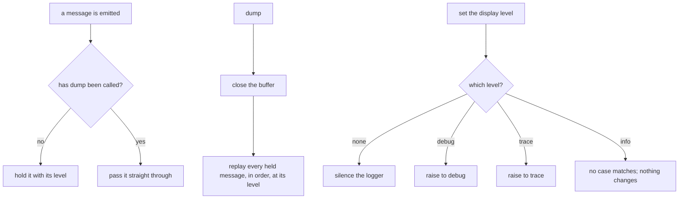
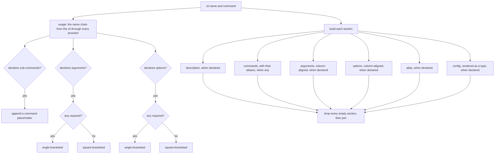
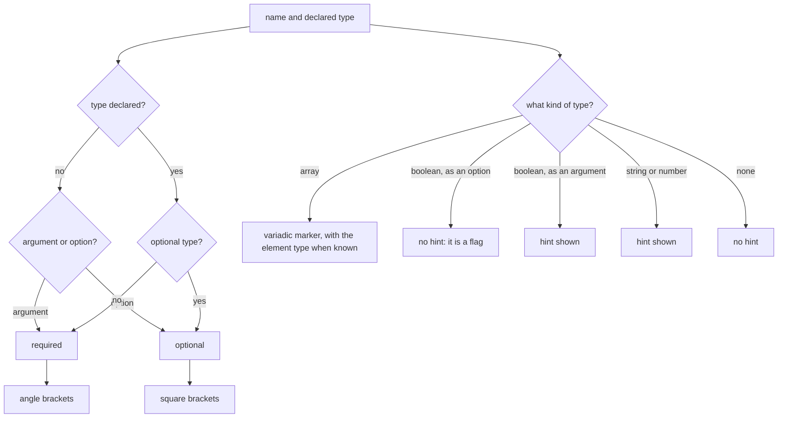
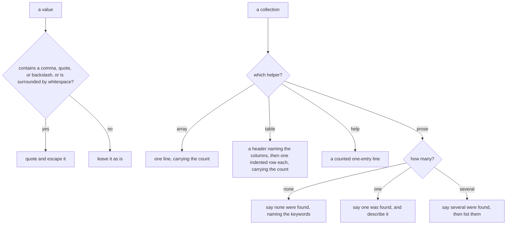

# Presentation

Governs `ts/ui.ts` and `ts/output.ts` — rendering help and usage, emitting
messages at their log level, and serializing a reported collection in the
format its reader asked for.

## What

Everything a CLI says passes through here. That splits into three jobs that look
unrelated but share one constraint: the CLI does not know who is reading.

**Messages** are emitted at a level, and the level is not known until argv has
been parsed — yet the framework has things to say before that. So the builder's
UI **buffers** every message and replays it once the level is settled, rather
than deciding too early and losing the ones it guessed wrong about.

**Help** is generated from the declaration, never written by hand. That is the
payoff for the framework reading declarations: a command that declares an
argument gets it documented, aligned, and marked required or optional without
its author writing a line of prose.

**Reported collections** are rendered in the format the reader asked for. The
default is TOON rather than prose, because a CLI's own metadata is read by an
agent far more often than by a person, and TOON is the cheaper read for one. It
is a default, not a replacement: `text` is the prose a human wants, and `json`
is what survives a pipe into `jq`. Counts are part of the TOON syntax, so a
reader never has to count entries or wonder whether a list was truncated.

**Non-goals.** Deciding *when* to show help or what to report belongs to
`execution/` and `builtin-commands/`. What may be declared belongs to
`command-definition/`. Describing a usage error in words belongs to
`execution/`, which owns the error types.

**Key terms.** The **display level** is how much the CLI says — none, info,
debug, or trace. A **signature** is a name as it appears in help, bracketed by
whether it is required and hinted with its type. **TOON** is the default
structured output shape; a **help line** is its trailing next-step suggestion.

## Use Cases

**Actors.**

| Actor | Reaches this capability | Goal |
| --- | --- | --- |
| CLI end user | reads help and messages | learn how to invoke the command without leaving the terminal |
| Agent or script | reads TOON or JSON output | parse the answer without branching on how many results there were |
| Command author | calls `this.ui.info` / `warn` / `error` | say something to the user at the right level |
| `execution` | calls `showHelp`, `showVersion`, `dump` | render at the moment it has decided to |
| `builtin-commands` | calls the TOON and prose helpers | report a collection in one house style across commands |

The agent is why the structured formats exist at all and why they are the
*default*; a capability serving only the terminal reader would have stopped at
prose.

### UC1 — `createBuilderUI`: say things before the level is known

**Actor / goal.** The framework wants to log during assembly, before argv has
told it how much to say.

| | |
| --- | --- |
| Trigger | messages emitted before `dump()` |
| Inputs | the message and its level |
| Outcome | the message is held, then replayed once the level is settled |

**Extensions.** After `dump()` the buffer is closed and messages pass straight
through; replay preserves both the order and the level each message was emitted
at.

### UC2 — the display level: control how much is said

**Actor / goal.** A user wants to turn logging off or turn diagnostics on.

| | |
| --- | --- |
| Trigger | setting or reading `displayLevel` |
| Inputs | one of none, info, debug, trace |
| Outcome | the underlying logger's threshold moves |

**Extensions.** Setting the level to `info` is a **no-op** — the setter has
cases for none, debug, and trace only. It is benign because the logger is
constructed at info, so the value is already what was asked for, but it means
the level cannot be lowered back to info once raised.

### UC3 — `showHelp`: render a command's help from its declaration

**Actor / goal.** A user wants to know how to invoke this command, and a command
author wants that without writing it.

| | |
| --- | --- |
| Trigger | `showHelp(cliName, command)` |
| Inputs | the application's name and the command declaration |
| Outcome | usage, description, commands, arguments, options, aliases, and config, in that order |

**Extensions.**

| Cause | Outcome |
| --- | --- |
| a section has nothing to show | it is dropped, not rendered empty |
| the command is nested | usage names the whole chain from the application through every ancestor |
| the command declares sub-commands | usage says a command is expected, and they are listed with their aliases |
| an argument or option is required | usage marks the group with angle brackets rather than square ones |
| the command declares a config schema | the schema's shape is rendered as a type |

### UC4 — the signature format: mark what is required and what it takes

**Actor / goal.** A reader scanning help wants to see at a glance whether
something is required and what kind of value it takes.

| | |
| --- | --- |
| Trigger | rendering an argument or option name into help |
| Inputs | the name and its declared type |
| Outcome | a bracketed signature with a type hint |

**Extensions.**

| Cause | Outcome |
| --- | --- |
| no type is declared | an argument is treated as required, an option as optional — matching how each is filled |
| the type is an array | a variadic marker is shown |
| the type is a boolean **option** | no type hint — an option is a flag, so `=boolean` would be noise |
| the type is a boolean **argument** | the hint is shown, because it is a value the user has to type out |
| the option declares aliases | they are shown with the name, shortest first, each dashed by its own length |
| an alias is marked hidden | it is left out |
| the option declares a default | the description names it, quoted when it is a string |

### UC5 — `showVersion`: report the application's version

| | |
| --- | --- |
| Trigger | `showVersion(version)` |
| Inputs | the version, if the application has one |
| Outcome | the version, or a phrase saying there is none |

**Extensions.** An application built without a version says so rather than
printing nothing, which would read as a failure.

### UC6 — the output helpers: render a reported collection

**Actor / goal.** A command reporting a collection wants one house style across
every command that reports one, in whichever format the reader asked for.

| | |
| --- | --- |
| Trigger | `toonArray` / `toonTable` / `toonHelp` / `reportProse`, and the shared `--format` option |
| Inputs | the collection and the reader's format |
| Outcome | the rendered lines |

**Extensions.**

| Cause | Outcome |
| --- | --- |
| a value contains a comma, quote, or backslash, or is surrounded by whitespace | it is quoted and escaped, so it cannot read as two entries |
| prose is asked for | the wording differs across none, exactly one, and several |
| a collection is rendered as TOON | the count is part of the syntax |

**Surface trace.**

| Element | Required by | May not combine with |
| --- | --- | --- |
| `createBuilderUI` / `dump` | UC1 | — |
| `createUI` and `displayLevel` | UC2 | — |
| `debug` / `info` / `warn` / `error` | UC1, UC2 | — |
| `showHelp` | UC3, UC4 | — |
| `showVersion` | UC5 | — |
| `toonValue` / `toonArray` / `toonTable` / `toonHelp` | UC6 | `toonTable` with a single column — it says what `toonArray` says for more tokens |
| `reportProse` | UC6 | — |
| `formatOption` / `OutputFormat` | UC6 | — |
| `OutputUI` | UC6 | — |

## Control Flow

### Sub-graph A — buffered messages and levels, entered by UC1 and UC2

### Sub-graph B — generate help (`showHelp`), entered by UC3

### Sub-graph C — a signature (`formatSignature`), entered by UC4

### Sub-graph D — render a collection, entered by UC6

## Scenario map

### UC1 — `createBuilderUI`

| Edge | Path (Given) | Scenario |
| --- | --- | --- |
| hold it with its level | before `dump` | `` `a message emitted before the level is settled is held rather than printed` `` |
| replay in order, at its level | `dump` called | `` `dumping replays every held message in order and at its own level` `` |
| pass it straight through | after `dump` | `` `a message emitted after dumping is printed straight away` `` |

### UC2 — the display level

| Edge | Path (Given) | Scenario |
| --- | --- | --- |
| silence the logger | level set to none | `` `setting the level to none silences the logger` `` |
| raise to debug | level set to debug | `` `setting the level to debug shows debug messages` `` |
| raise to trace | level set to trace | `` `setting the level to trace shows trace messages` `` |
| no case matches | level set to info | `` `setting the level to info changes nothing` `` |
| threshold mapping | any level set | `` `reading the level back reports the level that is in effect` `` |

### UC3 — `showHelp`

| Edge | Path (Given) | Scenario |
| --- | --- | --- |
| the name chain | a nested command | `` `usage names the whole chain from the application through every ancestor` `` |
| append a command placeholder | the command declares sub-commands | `` `usage says a command is expected when the command has sub-commands` `` |
| angle-bracketed | at least one required argument | `` `usage marks arguments as required when any of them is` `` |
| square-bracketed | no required argument | `` `usage marks arguments as optional when none of them is required` `` |
| angle-bracketed | at least one required option | `` `usage marks options as required when any of them is` `` |
| square-bracketed | no required option | `` `usage marks options as optional when none of them is required` `` |
| description, when declared | the command declares one | `` `a declared description is shown` `` |
| commands, with their aliases | sub-commands declared, some with aliases | `` `sub-commands are listed with their aliases` `` |
| arguments, column-aligned | arguments declared | `` `declared arguments are listed with their descriptions, aligned` `` |
| options, column-aligned | options declared | `` `declared options are listed with their descriptions, aligned` `` |
| alias, when declared | the command declares aliases | `` `a command's own aliases are shown` `` |
| config, rendered as a type | a config schema declared | `` `a declared config schema is shown as a type` `` |
| drop every empty section | a command declaring almost nothing | `` `a section with nothing to show is left out rather than rendered empty` `` |

### UC4 — the signature format

| Edge | Path (Given) | Scenario |
| --- | --- | --- |
| required, argument default | an argument with no declared type | `` `an argument with no type is shown as required` `` |
| optional, option default | an option with no declared type | `` `an option with no type is shown as optional` `` |
| square brackets | an optional type | `` `an optional type is shown in square brackets` `` |
| angle brackets | a non-optional type | `` `a required type is shown in angle brackets` `` |
| hint shown | a string or number type | `` `a string or number type is hinted beside the name` `` |
| variadic marker | an array type | `` `an array type is marked variadic` `` |
| no hint: it is a flag | a boolean option | `` `a boolean option is shown without a type hint, because it is a flag` `` |
| hint shown | a boolean argument | `` `a boolean argument keeps its type hint, because it must be typed out` `` |
| aliases shortest first | an option declaring aliases | `` `an option's aliases are shown with it, shortest first and dashed by length` `` |
| hidden alias left out | an option declaring a hidden alias | `` `a hidden alias is not shown` `` |
| the description names the default | an option declaring a default | `` `an option's default is named in its description` `` |
| quoted when a string | a string option with a default | `` `a string default is quoted in the description` `` |

### UC5 — `showVersion`

| Edge | Path (Given) | Scenario |
| --- | --- | --- |
| the version | the application has one | `` `an application with a version prints it` `` |
| a phrase | the application has none | `` `an application without a version says so rather than printing nothing` `` |

### UC6 — the output helpers

| Edge | Path (Given) | Scenario |
| --- | --- | --- |
| quote and escape it | a value containing a comma, quote, or backslash | `` `a value that could read as two entries is quoted and escaped` `` |
| quote and escape it | a value surrounded by whitespace | `` `a value surrounded by whitespace is quoted` `` |
| leave it as is | an ordinary value | `` `an ordinary value is left unquoted` `` |
| one line, carrying the count | an array rendered | `` `a rendered array carries its count, so nothing looks truncated` `` |
| a header, then one indented row each | a table rendered | `` `a rendered table names its columns and indents one row per entry` `` |
| a counted one-entry line | a help line rendered | `` `a help line is counted like any other rendered list` `` |
| say none were found | prose, empty collection | `` `prose for an empty collection names the keywords searched` `` |
| say one was found | prose, one item | `` `prose for one item describes it in the singular` `` |
| say several were found | prose, several items | `` `prose for several items lists them under a plural heading` `` |
| the shared option | any command reporting a collection | `` `every command reporting a collection offers the same three formats and defaults to toon` `` |
