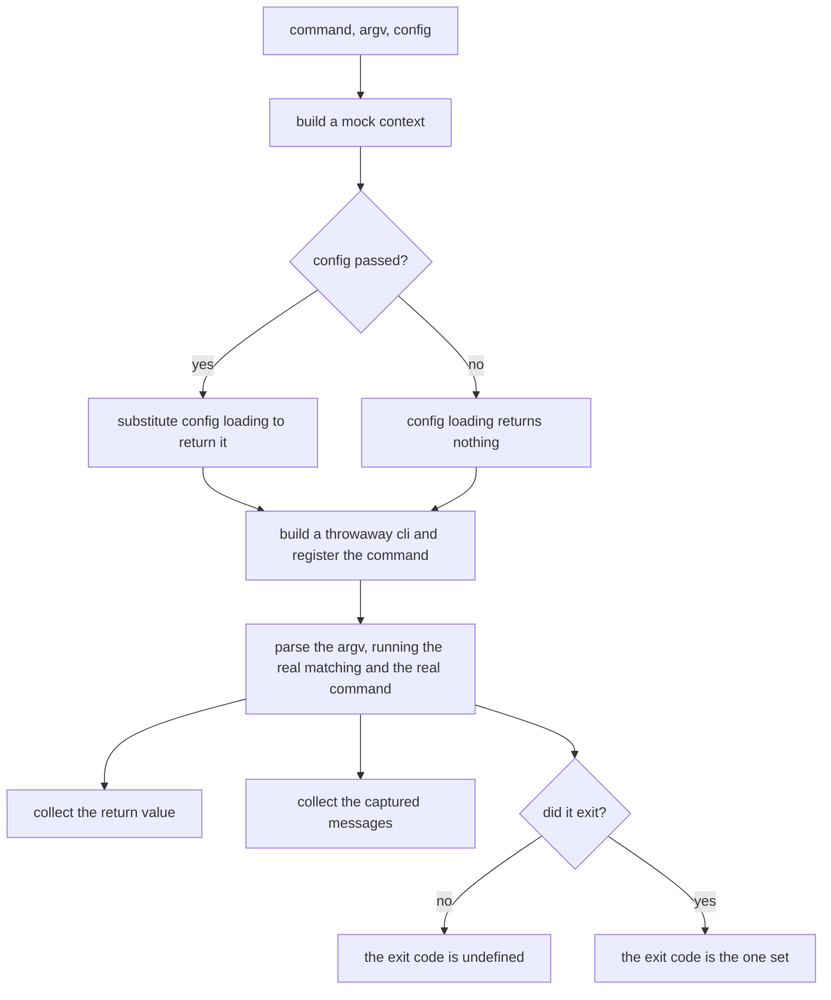
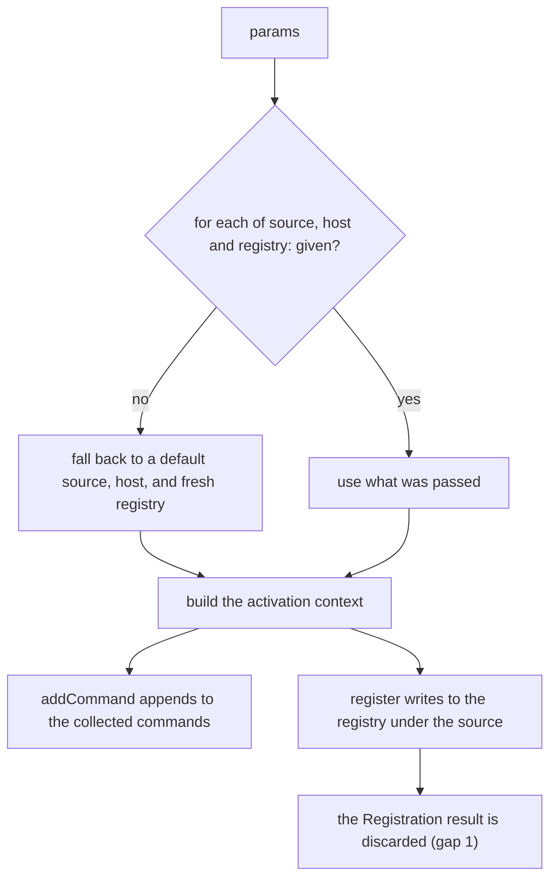
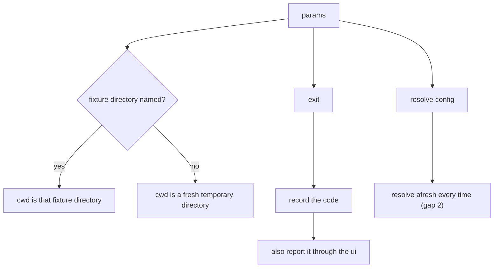
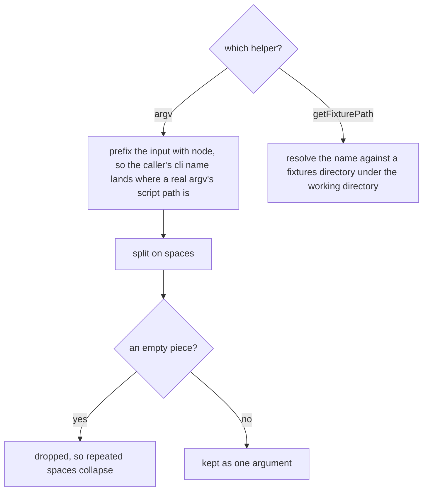

# Testing support

Governs `ts/testing/`, `ts/test-utils/`, and `ts/drivers/context.mock.ts` — the
helpers a command author uses to exercise a command and assert on its result
and messages without spawning a process.

## What

A CLI is awkward to test honestly. Running it for real means spawning a process,
which is slow, and asserting on its behavior means scraping stdout and reading
an exit status. Stubbing it out instead means testing something that is not the
CLI. These helpers take the middle path: they run the **real** builder, the real
matching, and the real command, and substitute only the three things that reach
outside the process — the working directory, the log destination, and the exit.

That substitution is what makes the assertions cheap. A test gets back the
command's **return value**, the **messages** it emitted, and the **exit code** it
would have set, as three ordinary values. Nothing is scraped and no process is
spawned.

The exit code is `undefined` when the command did not fail, deliberately
matching a process that exits zero — so a test asserting "it worked" asserts the
same absence a shell would see.

**Non-goals.** These helpers do not define what a command is (`command-definition/`),
how it is matched (`input-parsing/`), or what running it means (`execution/`).
They are the seam that lets those be exercised, not a second implementation of
them.

**Key terms.** A **fixture directory** is a real directory of files a test points
the CLI at. The **captured messages** are everything the CLI said, in order,
rather than written to a terminal. The **recorded exit code** is what the CLI
would have set on the process.

## Use Cases

**Actors.**

| Actor | Reaches this capability | Goal |
| --- | --- | --- |
| Command author | calls `testCommand` | assert what their command returned, said, and exited with, without spawning a process |
| Command author, writing the test's inputs | calls `argv` / `getFixturePath` | say what the user typed and where the test's files are, without hand-building an argv or a path |
| Plugin author | calls `mockPluginContext` | assert what their `activate` contributes, without a host CLI to run inside |
| `clibuilder`'s own tests | call `mockContext` | exercise the builder against a substitutable outside world |

### UC1 — `testCommand`: exercise one command end to end

**Actor / goal.** A command author wants to invoke their command the way a user
would, and assert on the outcome as values.

| | |
| --- | --- |
| Trigger | `testCommand(command, argv, config)` |
| Inputs | the command declaration, the argv as a string, and optionally a config |
| Outcome | the command's return value, the captured messages, and the recorded exit code |

**Extensions.**

| Cause | Outcome |
| --- | --- |
| the command did not fail | the exit code is undefined, matching a process that exits zero |
| the command failed | the exit code is the one it set |
| a config is passed | the command sees it, without a config file existing anywhere |
| no config is passed | the command sees no config |

### UC2 — `mockPluginContext`: exercise a plugin's activation

**Actor / goal.** A plugin author wants to call their own `activate` and assert
on what it contributed, without standing up a host.

| | |
| --- | --- |
| Trigger | `mockPluginContext(params)` |
| Inputs | optionally a source name, a host identity, and a registry |
| Outcome | an activation context, the commands it collects, and the registry it writes to |

**Extensions.**

| Cause | Outcome |
| --- | --- |
| no source, host, or registry is given | each falls back to a usable default, so the simple case takes no arguments |
| a registry is passed in | contributions land in it, so two plugins can be activated against one registry |
| **a registration is refused** | **it is dropped silently** — see the fidelity gaps below |

### UC3 — `mockContext`: substitute the outside world

**Actor / goal.** A test wants the real builder running against a working
directory, a log, and an exit it controls.

| | |
| --- | --- |
| Trigger | `mockContext(params)` |
| Inputs | optionally a fixture directory and a log level |
| Outcome | a context whose exit is recorded rather than taken |

**Extensions.**

| Cause | Outcome |
| --- | --- |
| a fixture directory is named | the working directory is that fixture |
| none is named | the working directory is a fresh temporary directory, so a test cannot see another's files |
| the CLI exits | the code is recorded **and** reported through the UI, so the exit is visible in the captured messages as well as assertable on its own |
| config is resolved more than once | **it is re-resolved each time** — see the fidelity gaps below |

### UC4 — `argv` / `getFixturePath`: the small helpers

**Actor / goal.** A command author writing a test wants to say what the user
typed, and where the files that test reads live, without restating the two
leading elements of a real argv or building an absolute path by hand.

| | |
| --- | --- |
| Trigger | `argv(input)`, `getFixturePath(target)` |
| Inputs | an invocation as a string; a fixture's name |
| Outcome | an argv array shaped like a real one; an absolute path under `fixtures` |

**Extensions.** `argv` splits on spaces, so an argument **containing** a space
cannot be expressed through it; a test needing one builds the array directly.
Repeated spaces collapse rather than producing empty arguments.

**Fidelity gaps.** Two test doubles differ from what they stand in for. Both are
filed in this spec's ledger; the suite fixes current behavior.

1. **`mockPluginContext.register` ignores the result.** The real activation
   context inspects the `Registration` and warns when a key is already owned.
   The mock discards it, so a plugin that collides with another plugin's key
   passes its own tests silently and warns only in production.
2. **`mockContext.resolveConfig` does not cache.** The real context caches the
   resolution as a promise so concurrent callers share one filesystem walk. The
   mock resolves afresh on every call, so a test cannot observe the caching, and
   a regression removing it from production would not be caught here.

**Surface trace.**

| Element | Required by | May not combine with |
| --- | --- | --- |
| `testCommand` | UC1 | — |
| `mockPluginContext` and its params | UC2 | — |
| `mockContext` and its params | UC3 | — |
| `mockContext.exitCode` | UC3 | — |
| `argv` | UC4 | an invocation whose argument contains a space |
| `getFixturePath` | UC4 | — |

## Control Flow

### Sub-graph A — `testCommand`, entered by UC1

### Sub-graph B — `mockPluginContext`, entered by UC2

### Sub-graph C — `mockContext`, entered by UC3

### Sub-graph D — the small helpers, entered by UC4

## Scenario map

### UC1 — `testCommand`

| Edge | Path (Given) | Scenario |
| --- | --- | --- |
| collect the return value | a command returning a value | `a command's return value comes back from the test helper` |
| collect the captured messages | a command that says something | `everything a command said is captured in order` |
| the exit code is undefined | a command that did not fail | `a command that did not fail records no exit code` |
| the exit code is the one set | a command that failed | `a command that failed records the exit code it set` |
| substitute config loading | a config passed to the helper | `a config passed to the helper reaches the command without a file existing` |
| config loading returns nothing | no config passed | `a command tested without a config sees none` |
| parse the argv | any invocation | `the argv string is parsed as though typed after the cli name` |

### UC2 — `mockPluginContext`

| Edge | Path (Given) | Scenario |
| --- | --- | --- |
| addCommand appends | a plugin adding commands | `commands a plugin adds are collected for the test to assert on` |
| register writes to the registry under the source | a plugin registering a value | `a value a plugin registers is stored under the mock's source` |
| fall back to a default source, host, and fresh registry | no params given | `the mock context takes no arguments in the simple case` |
| use what was passed | a source or host given | `a given source and host replace the defaults` |
| use what was passed | a registry given | `a shared registry lets two plugins be activated against one another` |
| the Registration result is discarded | a registration that is refused | `a refused registration is dropped silently rather than warned about` |

### UC3 — `mockContext`

| Edge | Path (Given) | Scenario |
| --- | --- | --- |
| cwd is that fixture directory | a fixture directory named | `a named fixture directory becomes the working directory` |
| cwd is a fresh temporary directory | no fixture directory named | `a context without a fixture gets a temporary directory of its own` |
| record the code | the cli exits | `an exit is recorded rather than taken` |
| also report it through the ui | the cli exits | `an exit also appears among the captured messages` |
| resolve afresh every time | config resolved more than once | `the mock resolves the config afresh on every call` |

### UC4 — `argv` / `getFixturePath`

| Edge | Path (Given) | Scenario |
| --- | --- | --- |
| prefix the input with node | any invocation string | `an invocation string becomes an argv array shaped like a real one` |
| dropped, so repeated spaces collapse | an invocation with repeated spaces | `repeated spaces do not become empty arguments` |
| resolve the name against a fixtures directory | a fixture name | `a fixture name resolves to an absolute path under the fixtures directory` |
